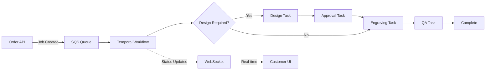
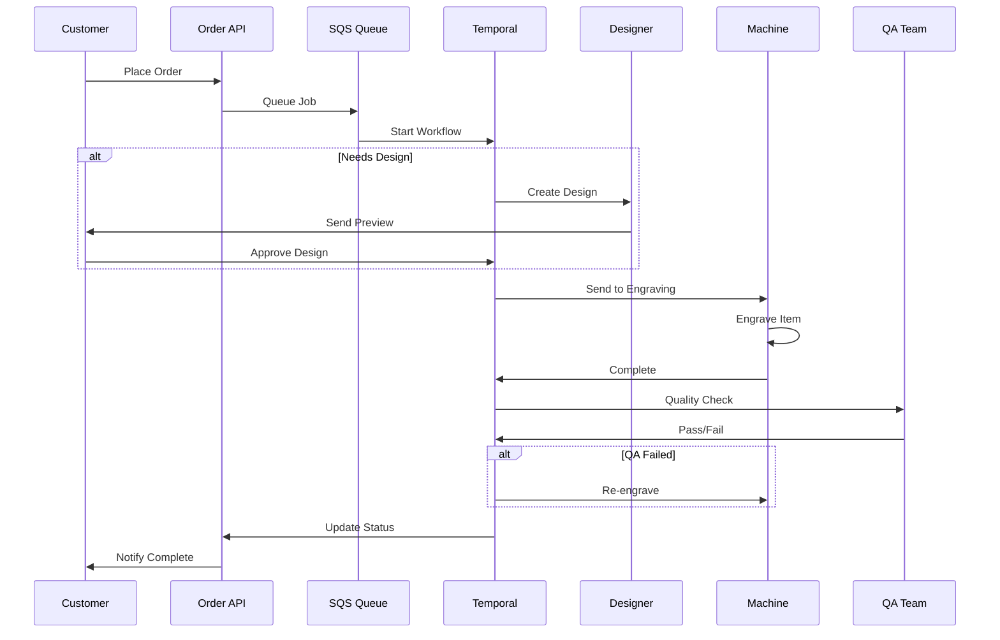
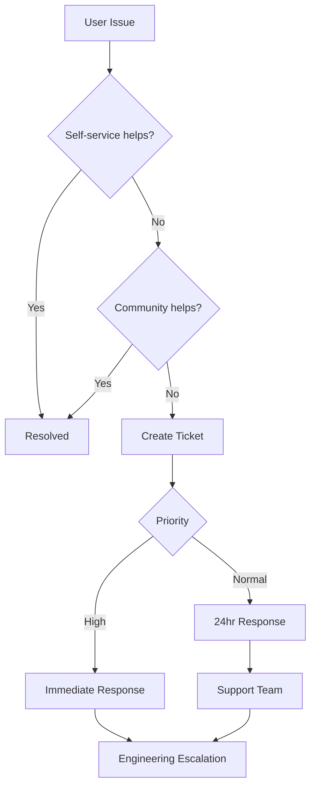
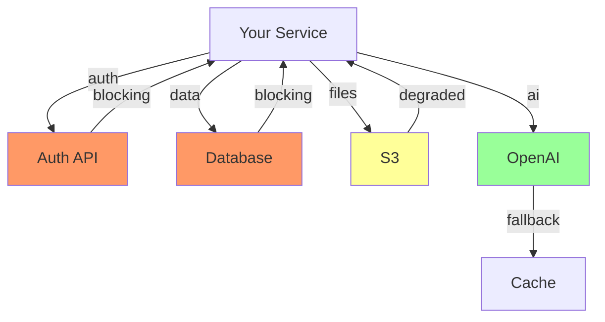

# 🚀 Candlefish Operating System v1.0 - MASTER DOCUMENT
*This document contains ALL 41 files of the Operating System in one place*
*Generated: 2025-08-31*

## 📊 Complete File Index

### Quick Navigation
Jump to any section using these links:

#### Core Documents
1. [Stakeholder Review Guide](#1-stakeholder-review-guide)
2. [README Start Here](#2-readme-start-here)
3. [Operating Charter](#3-operating-charter)
4. [Stage Gates Configuration](#4-stage-gates-configuration)
5. [Minimum Remarkable Checklist](#5-minimum-remarkable-checklist)

#### GitHub Integration
6. [CODEOWNERS](#6-codeowners)
7. [Issue Template: Feature](#7-issue-template-feature)
8. [Issue Template: Ops Task](#8-issue-template-ops-task)
9. [Issue Template: Decision Memo](#9-issue-template-decision-memo)
10. [Pull Request Template](#10-pull-request-template)
11. [GitHub Labels](#11-github-labels)

#### Operating Cadences
12. [Daily Unblock & Commit](#12-daily-unblock-commit)
13. [Weekly Demo Friday](#13-weekly-demo-friday)
14. [Monthly Portfolio Council](#14-monthly-portfolio-council)

#### Decision Memos
15. [Unified Auth Decision](#15-unified-auth-decision)
16. [AI Preview Decision](#16-ai-preview-decision)
17. [Mobile Capture Decision](#17-mobile-capture-decision)

#### Idea Management
18. [Idea Ledger Schema](#18-idea-ledger-schema)
19. [Idea Ledger Seed Data](#19-idea-ledger-seed-data)

#### Slack Communication Kits
20. [Charter Launch Announcement](#20-charter-launch-announcement)
21. [Demo Friday Reminders](#21-demo-friday-reminders)
22. [Gate Promotion Notices](#22-gate-promotion-notices)

#### Pod-Specific Artifacts
23. [Crown Trophy: Inventory Schema](#23-crown-trophy-inventory-schema)
24. [Crown Trophy: Engraving Flow](#24-crown-trophy-engraving-flow)
25. [Paintbox: Scope Map](#25-paintbox-scope-map)
26. [PromoterOS: Relationship Cadence](#26-promoteros-relationship-cadence)
27. [Ratio: Ops Telemetry MVP](#27-ratio-ops-telemetry-mvp)

#### Runbooks
28. [Kill Switch Runbook](#28-kill-switch-runbook)
29. [Dependency Mapping](#29-dependency-mapping)
30. [Handoff Procedures](#30-handoff-procedures)

#### Validation & Rollout
31. [Charter Acceptance Tests](#31-charter-acceptance-tests)
32. [30-60-90 Day Rollout Plan](#32-30-60-90-rollout-plan)

#### Calendar Files (ICS)
33. [Daily Standup Calendar](#33-daily-standup-calendar)
34. [Demo Friday Calendar](#34-demo-friday-calendar)
35. [Portfolio Council Calendar](#35-portfolio-council-calendar)

---

## 📁 Complete File Contents


---

## 1. STAKEHOLDER REVIEW GUIDE

# Operating System Review Guide - Tyler, Aaron, James

## Quick Context (2 min read)

I've built an operating system to help us ship predictably without losing our creative edge. Think of it as "infrastructure for velocity" - not bureaucracy, but acceleration rails.

**Core insight:** We're great at 0→1 and polish. We need a system that handles the middle mile so we can focus on what we do best.

## Your Review Focus

### Tyler - Technical Feasibility & Developer Experience
**Time needed:** 20 minutes  
**Focus on:**
1. **GitHub Integration** (`.github/` folder)
   - Will these workflows actually help or create friction?
   - Are the templates practical for real development?
   - Check `stage-gates.yaml` - is this automatable?

2. **Technical Artifacts**
   - `pods/crown-trophy/engraving-flow.md` - Does the SQS/Temporal approach make sense?
   - `pods/ratio/ops-telemetry-mvp.yaml` - Realistic for brewing ops?
   - WIP limits in practice - will devs revolt?

3. **Developer Rhythm**
   - Daily Unblock & Commit - too much overhead?
   - Demo Friday format - sustainable?

**Key Question:** *"Would you actually want to work in this system?"*

### Aaron - Product Strategy & Customer Value
**Time needed:** 15 minutes  
**Focus on:**
1. **Stage Gates** (`Charter.md` sections 2-3)
   - Do these gates map to real product development?
   - Will this help or hinder product iteration speed?

2. **Minimum Remarkable** (`minimum-remarkable-checklist.md`)
   - Is this bar too high? Too low?
   - Does it capture what makes products worth shipping?

3. **Pod Artifacts**
   - `pods/paintbox/scope-map-v1.md` - Are these the right priorities?
   - `pods/promoteros/relationship-cadence.yaml` - Will this drive revenue?

**Key Question:** *"Will this help us ship better products faster?"*

### James - Business Impact & Scalability
**Time needed:** 15 minutes  
**Focus on:**
1. **ROI & Metrics** (`validation/charter-acceptance-test.md`)
   - Are the success metrics realistic?
   - 60-day targets achievable?
   - What's the real cost of implementation?

2. **Portfolio Management** (`Charter.md` + `decision-memos/`)
   - Portfolio Council structure - efficient use of time?
   - 3-paths decision framework - practical?
   - Kill switches - will we actually use them?

3. **Scale Implications**
   - Works at 10 people, but what about 50?
   - How does this affect hiring/onboarding?
   - Customer impact of this structure?

**Key Question:** *"Is the juice worth the squeeze?"*

## How to Review

### Option A: Speed Run (5 minutes)
1. Read `README_START_HERE.md` - the 30-minute adoption guide
2. Skim `Charter.md` - just the Executive Summary and Stage Gates
3. Check one pod artifact relevant to you

### Option B: Deep Dive (30 minutes)
1. Start with `DELIVERY_SUMMARY.md` for the full picture
2. Read `Charter.md` completely
3. Review `stage-gates.yaml` for automation details
4. Check `rollout/30-60-90-plan.md` for implementation reality
5. Look at your specific focus areas above

### Option C: Practical Test (15 minutes)
1. Pick one of your current projects
2. Try to map it to a stage gate
3. Run through the `minimum-remarkable-checklist.md`
4. Would the daily/weekly cadences help or hurt?

## Specific Feedback Needed

### Must Have Answers
1. **Deal Breakers:** What would make this system fail?
2. **Missing Pieces:** What critical element is absent?
3. **Oversights:** Where am I being naive?

### Nice to Have
1. **Improvements:** What would make this 10x better?
2. **Shortcuts:** What can we simplify without losing value?
3. **Quick Wins:** What should we implement first?

## Response Format

**Best:** 15-minute call to walk through your reactions
**Good:** Slack DM with bullet points
**Fine:** Comments in thread

## Implementation Options

### A. Full Send (Recommended if feedback positive)
- Monday: Announce to team
- Tuesday: Start daily standups
- Friday: First Demo Friday
- 30 days: Full system running

### B. Pilot Pod (Lower risk)
- Choose one pod (suggest Crown Trophy)
- Run for 30 days
- Measure everything
- Expand if successful

### C. Cherry Pick (Safest)
- Just implement Demo Friday first
- Add daily standups week 2
- Layer in gates gradually
- Full system over 60 days

## The Real Question

**"Does this system help us become the company we want to be?"**

Not perfect, not complete, but directionally correct and iteratively improvable.

---

*Review by: Friday EOD ideally*
*Decision: Monday Portfolio Council (or just us if you prefer)*

**Remember:** This is v1. We'll iterate based on what we learn. The goal is sustainable velocity, not perfection.

---

## Slack Message to Send

```
@tyler @aaron @james 

Built out our operating system draft - the infrastructure for shipping predictably without killing creativity.

**The gist:** Stage gates (Spark→Seed→Scaffold→Ship→Scale) + WIP limits + daily standups + Demo Fridays + kill switches for zombie projects.

**Quick review:** `/candlefish-spine/STAKEHOLDER_REVIEW_GUIDE.md` (this doc)
**Full explore:** `/candlefish-spine/README_START_HERE.md`
**Deep dive:** `/candlefish-spine/Charter.md`

**Need your take on:**
- Tyler: Will devs revolt? Is the GitHub automation realistic?
- Aaron: Does this help or hurt product velocity? 
- James: Worth the implementation cost? Scalable?

**Time needed:** 15-20 min to review, 15 min to discuss

Can we sync Friday afternoon? Or async feedback works too.

Not married to any of this - let's make it work for us.
```
---

## 2. README START HERE

# 🚀 Candlefish Operating System - Start Here

**Time to adopt: 30 minutes**  
**Time to mastery: 30 days**

## What This Is

The Candlefish Operating System codifies how we ship remarkable products predictably. It's not bureaucracy—it's acceleration infrastructure.

## Quick Start (10 minutes)

### 1. Understand the Core Loop (2 min)
```
Spark → Seed → Scaffold → Ship → Scale
  ↑                                ↓
  ←───── Kill Switch (if needed) ←─
```

Every piece of work flows through these gates. No exceptions.

### 2. Label Your Current Work (3 min)
Look at what you're working on right now. Which stage is it in?

- **Spark**: Just an idea, exploring feasibility
- **Seed**: Validating technical approach
- **Scaffold**: Building core functionality  
- **Ship**: Polishing for production
- **Scale**: Optimizing what's live

Add the appropriate label to your GitHub issues/PRs.

### 3. Join Tomorrow's Standup (2 min)
At 10:00 AM PST, post in #unblock-and-commit:

```
✅ Completed Yesterday: [What you finished]
🚧 Blocked On: [What's stopping you, tag owner]
📝 Committing Today: [What you'll complete]
```

### 4. Book Demo Friday Slot (2 min)
If you'll ship something this week, claim a Demo Friday slot in #demo-friday.
Remember: Live demos only, no slides.

### 5. Add One Idea (1 min)
Think of one improvement, feature, or fix. Add it to the Idea Ledger (link in #operations).

**Congrats! You're now operating in the system.** 🎉

## Full Adoption Checklist (20 minutes)

### Week 1: Get Into Rhythm
- [ ] Read the [Charter](./Charter.md) (10 min)
- [ ] Review [stage-gates.yaml](./stage-gates.yaml) for your current work
- [ ] Attend Demo Friday (Fridays 1pm PST)
- [ ] Post daily in Unblock & Commit
- [ ] Add 3+ ideas to Idea Ledger

### Week 2: Use the System
- [ ] Progress one item through a gate
- [ ] Review [Minimum Remarkable checklist](./minimum-remarkable-checklist.md)
- [ ] Present at Demo Friday
- [ ] Resolve someone else's blocker
- [ ] Use a [runbook](./runbooks/) for a task

### Week 3: Master the Flow
- [ ] Own an item from Spark to Ship
- [ ] Write a Decision Memo for a choice
- [ ] Help someone with gate progression
- [ ] Contribute to a pod outside yours
- [ ] Identify a process improvement

### Week 4: Full Proficiency
- [ ] Attend Portfolio Council (first Monday)
- [ ] Have zero WIP violations
- [ ] Ship something remarkable
- [ ] Mentor someone on the system
- [ ] Celebrate your first month! 🎊

## Key Resources

### Essential Documents
1. **[Charter.md](./Charter.md)** - The constitution
2. **[stage-gates.yaml](./stage-gates.yaml)** - Gate definitions
3. **[minimum-remarkable-checklist.md](./minimum-remarkable-checklist.md)** - Quality bar

### Daily Tools
- **GitHub Templates**: `.github/ISSUE_TEMPLATE/`
- **Slack Kits**: `ops/kits/slack/`
- **Runbooks**: `runbooks/`

### Cadence Docs
- **[Daily Unblock](./cadence/daily_unblock_commit.md)** - Every weekday 10am
- **[Demo Friday](./cadence/weekly_demo_friday.md)** - Fridays 1pm
- **[Portfolio Council](./cadence/monthly_portfolio_council.md)** - First Monday 11am

### Calendar Files
Import these to your calendar:
- `cadence/daily-unblock-commit.ics`
- `cadence/weekly-demo-friday.ics`
- `cadence/monthly-portfolio-council.ics`

## Your Pod's Specific Resources

### Crown Trophy
- [Inventory Schema](./pods/crown-trophy/inventory-schema-v1.yaml)
- [Engraving Flow](./pods/crown-trophy/engraving-flow.md)

### Paintbox
- [Scope Map](./pods/paintbox/scope-map-v1.md)
- Top priority: Quick Quote to Contract story

### PromoterOS
- [Relationship Cadence](./pods/promoteros/relationship-cadence.yaml)
- CRM fields ready for implementation

### Ratio
- [Ops Telemetry MVP](./pods/ratio/ops-telemetry-mvp.yaml)
- Phase 1: Temperature sensors this week

## FAQ

### "This feels like too much process"
It's actually less process—it's just visible now. You're already doing these things; we're making them systematic so you don't have to think about them.

### "What if I don't know what gate something is in?"
Ask in #operations or DM @integrator-pod. When in doubt, start with Spark.

### "Do I have to do the daily standup?"
Yes, but it takes 2 minutes. The ROI is huge—blockers get resolved faster.

### "What if I can't demo on Friday?"
That's fine! Demo when you have something to show. But aim for at least once a month.

### "Can I skip gates?"
No. Gates ensure quality and prevent waste. But gates can progress quickly if criteria are met.

### "Who decides gate progression?"
- Spark → Seed: You + Pod Lead
- Seed → Scaffold: Integrator Pod
- Scaffold → Ship: Pod Lead + Integrator Pod
- Ship → Scale: Portfolio Council

### "What if something gets killed?"
That's success, not failure. We learned something and freed resources for better work.

## Get Help

### Immediate Help
- **Slack**: #operations (monitored continuously)
- **DM**: @integrator-pod
- **Emergency**: @patrick

### Learning Resources
- Weekly office hours: Tuesdays 3pm
- Recorded trainings: [Drive folder]
- Peer mentoring: Ask in #operations

### Feedback Welcome
This system will evolve. Share what's working and what's not:
- Weekly retro thread in #operations
- Anonymous feedback: [Form link]
- Direct to Patrick: Always open

## Success Metrics

You'll know you've mastered the system when:
- Your work flows predictably through gates
- You're never blocked for >24 hours
- You ship something every 2-3 weeks
- Your demos get "oohs" and "ahhs"
- You help others navigate the system

## First Day Action Items

**Right now (5 min):**
1. Label your current work with a stage gate
2. Join #unblock-and-commit and #demo-friday
3. Add tomorrow's standup to your calendar

**Tomorrow (10 min):**
1. Post your standup update at 10am
2. Read one runbook relevant to your work
3. Add an idea to the Idea Ledger

**This week (30 min):**
1. Progress one item through a gate
2. Attend Demo Friday (or watch recording)
3. Help resolve someone's blocker

## Why This Matters

We're building a company that ships remarkable products predictably. This system is how we:
- Maintain creative edge while scaling
- Prevent burnout through sustainable pace
- Ensure everything we ship is remarkable
- Build a company worth being part of

You're not just following a process—you're building an institution.

---

## Quick Reference Card

```yaml
Daily Rhythm:
  10:00 AM: Post standup update
  10:15 AM: Check for blockers to help
  Ongoing:  Progress work through gates

Weekly Rhythm:
  Monday:    Review your gate status
  Tuesday:   Office hours if needed
  Wednesday: Update Idea Ledger
  Thursday:  Prep for Demo Friday
  Friday:    Demo or attend demos

Monthly Rhythm:
  Week 1: Portfolio Council (first Monday)
  Week 2: Focus on shipping
  Week 3: Gather ideas for next cycle
  Week 4: Reflection and improvement

Remember:
  - Remarkable is the minimum
  - Ship small, ship often
  - Kill quickly, learn completely
  - Help others unblock
  - Celebrate every ship
```

---

**Welcome to the Candlefish Operating System.**  
Let's ship remarkable things. 🚀

*Questions? Start in #operations or DM @integrator-pod*

---
*Version 1.0 | Generated: 2025-08-31*  
*"Ship remarkable products predictably without sacrificing creative edge."*
---

## 3. OPERATING CHARTER

# Candlefish Operating Charter
*Version 1.0 | Generated: 2025-08-31*

## Executive Summary

Candlefish operates as a dual-engine organization: Patrick drives Spark & Elevation while our System delivers Integration & Finish. This charter codifies how we ship remarkable products predictably without sacrificing creative edge.

## Operating Archetype

### Dual-Engine Model
- **Engine 1: Spark & Elevation** (Patrick)
  - 0→1 creation
  - Polish passes
  - Strategic vision
  - Quality elevation

- **Engine 2: Integration & Finish** (System)
  - Middle-mile execution
  - Cross-pod coordination
  - Delivery cadence
  - Operational excellence

## Stage-Gate Framework

### Gate Progression
**Spark → Seed → Scaffold → Ship → Scale**

Each gate enforces explicit criteria before promotion. No skipping gates. Kill-switches activate automatically on criteria breach.

### Gate Definitions

#### Spark Gate
- **Purpose**: Capture and qualify ideas
- **Entry**: Problem statement + hypothesis
- **Exit**: Strategic fit score ≥3/5, Impact ≥3/5
- **Artifacts**: Idea Ledger entry, initial POV
- **Review**: Weekly during Unblock & Commit
- **Auto-kill**: No progress for 30 days

#### Seed Gate
- **Purpose**: Validate feasibility
- **Entry**: Approved Spark
- **Exit**: Technical spike complete, dependency map
- **Artifacts**: Decision Memo, risk assessment
- **Review**: Integrator Pod sign-off
- **Auto-kill**: Blocking dependencies unresolved for 14 days

#### Scaffold Gate
- **Purpose**: Build foundation
- **Entry**: Approved Seed with owner assigned
- **Exit**: Core functionality working, test coverage >60%
- **Artifacts**: API contracts, acceptance tests, demo recording
- **Review**: Demo Friday presentation
- **Auto-kill**: Failed acceptance tests for 7 days

#### Ship Gate
- **Purpose**: Polish and release
- **Entry**: Scaffold complete, Minimum Remarkable checklist started
- **Exit**: All checklist items green, production deployed
- **Artifacts**: Release notes, support runbook, metrics dashboard
- **Review**: Portfolio Council approval
- **Auto-kill**: Customer-impacting bugs unresolved for 48 hours

#### Scale Gate
- **Purpose**: Optimize and expand
- **Entry**: Shipped with 30-day stability
- **Exit**: Performance targets met, operational handoff complete
- **Artifacts**: Optimization report, scaling plan
- **Review**: Quarterly business review
- **Auto-kill**: SLA violations for 3 consecutive days

## WIP Limits

### System Constraints
- **Per Pod**: Maximum 3 items in Scaffold stage
- **Per Person**: Maximum 2 items owned across all stages
- **Cross-Pod**: Maximum 5 active Seed explorations
- **Portfolio**: Maximum 10 total items in flight

### Enforcement
- GitHub Actions block new work when limits exceeded
- Weekly review identifies constraint violations
- Automatic prioritization forcing function on breach

## Kill-Switch Protocol

### Automatic Triggers
1. **Time-based**: Stage timeout exceeded
2. **Quality-based**: Minimum Remarkable violations
3. **Resource-based**: 2x effort overrun
4. **Strategic-based**: Fit score drops below 2/5

### Graceful Shutdown
1. Document learnings in Decision Memo
2. Archive code to `/experiments`
3. Extract reusable components
4. Update Idea Ledger with post-mortem

## Operating Cadences

### Daily: Unblock & Commit (15 min)
- **Time**: 10:00 PST
- **Format**: Async Slack thread
- **Template**: Completed / Blocked / Committing
- **Escalation**: Blocks >24hrs → Integrator Pod

### Weekly: Demo Friday (60 min)
- **Time**: Fridays 13:00 PST
- **Format**: Live demos only (no slides)
- **Recognition**: Ship of the Week award
- **Recording**: Posted to #demo-friday

### Monthly: Portfolio Council (60 min)
- **Time**: First Monday 11:00 PST
- **Format**: 3-paths decision framework
- **Output**: One strategic decision
- **Attendees**: Patrick + Pod Leads

## Roles & Responsibilities

### Integrator Pod
- Cross-pod dependency management
- Gate promotion reviews
- Blocker resolution
- Cadence facilitation

### Pod Leads
- Stage-gate compliance
- WIP limit enforcement
- Demo preparation
- Team health monitoring

### Individual Contributors
- Idea Ledger contributions
- Daily commits
- Acceptance test authoring
- Documentation maintenance

## Minimum Remarkable Standard

### Definition
Every shipped feature must be:
1. **Story Clear**: User can explain value in one sentence
2. **Performance Floor**: <100ms interaction, <3s load
3. **Accessibility**: WCAG 2.1 AA compliant
4. **Observable**: Metrics dashboard exists
5. **Supported**: Runbook and error states documented
6. **Delightful**: One moment of unexpected polish

### Verification
- Checklist reviewed at Scaffold→Ship promotion
- Any red item blocks Ship gate
- Patrick reserves elevation veto

## Decision Memo Protocol

### When Required
- Resource allocation >$10k or >2 weeks
- Architectural decisions
- Strategic pivots
- Partnership agreements

### Structure
1. Context (3 sentences max)
2. Three paths with tradeoffs
3. Recommendation with rationale
4. Reversible vs irreversible assessment
5. Success metrics

### Storage
- Markdown in `/decision-memos`
- Linked from relevant GitHub issues
- Reviewed in Portfolio Council

## Idea Ledger Management

### Capture Rules
- Anyone can add ideas
- No idea too small or large
- Anonymous submissions allowed
- Quarterly pruning of stale items

### Scoring Formula
```
Score = (Impact × Strategic Fit) / Effort
```

### Review Cadence
- Weekly: New submissions triaged
- Monthly: Top 10 reviewed for promotion
- Quarterly: Full ledger cleanup

## Recognition Culture

### Mechanisms
- Demo Friday: Ship of the Week
- Monthly: Integrator Award
- Quarterly: Innovation Prize
- Annual: Founder's Excellence

### Rewards
- Public recognition
- Repository contributor credits
- Conference/training budget
- Equity acceleration consideration

## Conflict Resolution

### Escalation Path
1. Direct conversation
2. Pod Lead mediation
3. Integrator Pod review
4. Patrick decision
5. External advisor consultation

### Decision Rights
- Technical: Pod Lead decides
- Resource: Integrator Pod decides
- Strategic: Patrick decides
- Cultural: Team consensus required

## Amendment Process

This charter may be amended through:
1. Proposal in Decision Memo format
2. Two-week comment period
3. Portfolio Council approval
4. 30-day implementation grace period

## Appendices

### A. Gate Artifact Templates
See `.github/ISSUE_TEMPLATE/` in spine repo

### B. Scoring Rubrics
See `minimum-remarkable-checklist.md`

### C. Tool Configuration
See `stage-gates.yaml` for automation rules

### D. Historical Decisions
See `/decision-memos` archive

---

*"Ship remarkable products predictably without sacrificing creative edge."*

**Candlefish.ai** | Quiet authority in software craft
---

## 4. STAGE GATES CONFIGURATION

```yaml
# Candlefish Stage-Gate Configuration
# Version: 1.0 | Generated: 2025-08-31
# This file drives automation in GitHub Actions and defines progression criteria

gates:
  spark:
    name: "Spark"
    description: "Idea capture and qualification"
    entry_criteria:
      - problem_statement_exists: true
      - hypothesis_defined: true
      - idea_ledger_entry: true
    
    required_artifacts:
      - type: "idea_ledger_entry"
        location: "Notion:Idea-Ledger"
        fields:
          - problem_statement
          - hypothesis
          - impact_score
          - effort_score
          - strategic_fit_score
      
      - type: "initial_pov"
        location: "issue_description"
        min_length: 200
    
    exit_criteria:
      - strategic_fit_score: ">=3"
      - impact_score: ">=3"
      - feasibility_check: "completed"
    
    reviewers:
      - role: "pod_lead"
        required: false
      - role: "integrator_pod"
        required: true
    
    promotion_test:
      script: ".github/scripts/validate-spark.sh"
      timeout: 300
    
    auto_kill_triggers:
      - condition: "days_since_update > 30"
        action: "archive"
        notification: "owner,pod_lead"
      
      - condition: "strategic_fit_score < 2"
        action: "reject"
        notification: "owner"
    
    sla: "7 days"

  seed:
    name: "Seed"
    description: "Feasibility validation and planning"
    entry_criteria:
      - spark_gate_passed: true
      - owner_assigned: true
      - pod_identified: true
    
    required_artifacts:
      - type: "technical_spike"
        location: "repo:spikes/"
        validation:
          - code_compiles: true
          - readme_exists: true
      
      - type: "dependency_map"
        location: "repo:docs/dependencies/"
        format: "mermaid|graphviz|yaml"
      
      - type: "decision_memo"
        location: "repo:decision-memos/"
        template: "decision-memo.md"
        required_sections:
          - context
          - three_paths
          - recommendation
          - reversibility
          - success_metrics
    
    exit_criteria:
      - technical_feasibility: "proven"
      - dependencies_identified: true
      - risk_assessment: "completed"
      - effort_estimate: "documented"
    
    reviewers:
      - role: "integrator_pod"
        required: true
      - role: "technical_lead"
        required: true
      - role: "patrick"
        required: "if effort > 2 weeks"
    
    promotion_test:
      script: ".github/scripts/validate-seed.sh"
      timeout: 600
    
    auto_kill_triggers:
      - condition: "blocking_dependencies_unresolved > 14 days"
        action: "escalate"
        notification: "integrator_pod,patrick"
      
      - condition: "effort_estimate > 3x original"
        action: "review"
        notification: "portfolio_council"
    
    sla: "14 days"

  scaffold:
    name: "Scaffold"
    description: "Build core functionality"
    entry_criteria:
      - seed_gate_passed: true
      - acceptance_criteria_defined: true
      - api_contracts_drafted: true
    
    required_artifacts:
      - type: "core_implementation"
        location: "repo:src/"
        validation:
          - builds: true
          - lints_pass: true
          - no_security_warnings: true
      
      - type: "test_suite"
        location: "repo:tests/"
        validation:
          - coverage: ">60%"
          - all_pass: true
          - integration_tests_exist: true
      
      - type: "api_documentation"
        location: "repo:docs/api/"
        format: "openapi|graphql|proto"
      
      - type: "demo_recording"
        location: "artifacts:demos/"
        max_duration: "5 minutes"
        required_elements:
          - user_flow
          - error_handling
          - performance_metrics
    
    exit_criteria:
      - core_features_complete: true
      - test_coverage: ">60%"
      - demo_approved: true
      - acceptance_tests_passing: true
    
    reviewers:
      - role: "pod_lead"
        required: true
      - role: "qa_engineer"
        required: "if exists"
      - role: "design_lead"
        required: "if ui_changes"
    
    promotion_test:
      script: ".github/scripts/validate-scaffold.sh"
      timeout: 1200
      stages:
        - lint
        - test
        - build
        - acceptance
    
    auto_kill_triggers:
      - condition: "acceptance_tests_failing > 7 days"
        action: "block"
        notification: "owner,pod_lead,integrator_pod"
      
      - condition: "wip_limit_exceeded"
        action: "queue"
        notification: "owner"
    
    sla: "21 days"

  ship:
    name: "Ship"
    description: "Polish and production release"
    entry_criteria:
      - scaffold_gate_passed: true
      - minimum_remarkable_checklist: "started"
      - deployment_plan_exists: true
    
    required_artifacts:
      - type: "production_code"
        location: "repo:src/"
        validation:
          - security_scan_passed: true
          - performance_benchmarks_met: true
          - accessibility_audit_passed: true
      
      - type: "minimum_remarkable_checklist"
        location: "repo:ship-checklist.md"
        all_items_green: true
      
      - type: "release_notes"
        location: "repo:CHANGELOG.md"
        required_sections:
          - features
          - fixes
          - breaking_changes
          - migration_guide
      
      - type: "support_runbook"
        location: "repo:runbooks/"
        required_sections:
          - common_issues
          - escalation_path
          - rollback_procedure
          - monitoring_queries
      
      - type: "metrics_dashboard"
        location: "links:grafana|datadog|cloudwatch"
        required_panels:
          - availability
          - latency
          - error_rate
          - business_metrics
    
    exit_criteria:
      - production_deployed: true
      - monitoring_active: true
      - documentation_complete: true
      - team_trained: true
    
    reviewers:
      - role: "integrator_pod"
        required: true
      - role: "portfolio_council"
        required: true
      - role: "patrick"
        required: "for elevation_review"
    
    promotion_test:
      script: ".github/scripts/validate-ship.sh"
      timeout: 1800
      environments:
        - staging
        - production
    
    auto_kill_triggers:
      - condition: "customer_impacting_bugs > 48 hours"
        action: "rollback"
        notification: "all_stakeholders"
      
      - condition: "minimum_remarkable_violations > 0"
        action: "block"
        notification: "patrick"
    
    sla: "7 days"

  scale:
    name: "Scale"
    description: "Optimize and expand"
    entry_criteria:
      - ship_gate_passed: true
      - stability_period: "30 days"
      - usage_metrics_baseline: true
    
    required_artifacts:
      - type: "optimization_report"
        location: "repo:reports/scale/"
        metrics:
          - performance_improvements
          - cost_reductions
          - capacity_increases
      
      - type: "scaling_plan"
        location: "repo:docs/scaling/"
        required_sections:
          - current_limits
          - target_capacity
          - migration_strategy
          - cost_projection
      
      - type: "operational_handoff"
        location: "repo:ops/"
        checklists:
          - monitoring_setup
          - alerting_rules
          - backup_procedures
          - disaster_recovery
    
    exit_criteria:
      - performance_targets_met: true
      - operational_maturity: "L2"
      - documentation_complete: true
      - team_onboarded: true
    
    reviewers:
      - role: "operations_lead"
        required: true
      - role: "portfolio_council"
        required: "quarterly"
    
    promotion_test:
      script: ".github/scripts/validate-scale.sh"
      timeout: 3600
      load_test: true
    
    auto_kill_triggers:
      - condition: "sla_violations > 3 consecutive days"
        action: "incident"
        notification: "on_call,patrick"
      
      - condition: "cost_overrun > 50%"
        action: "review"
        notification: "portfolio_council"
    
    sla: "ongoing"

# Global Configuration
configuration:
  wip_limits:
    per_pod:
      scaffold: 3
      total: 5
    per_person:
      owned: 2
      involved: 4
    cross_pod:
      seed: 5
    portfolio:
      total_active: 10
  
  notification_channels:
    slack:
      default: "#engineering"
      escalation: "#incidents"
      demos: "#demo-friday"
      blockers: "#unblock-and-commit"
    
    email:
      pod_leads: "pod-leads@candlefish.ai"
      integrator_pod: "integrators@candlefish.ai"
      portfolio_council: "council@candlefish.ai"
  
  automation:
    github_actions:
      - ".github/workflows/stage-gates.yml"
      - ".github/workflows/wip-enforcer.yml"
      - ".github/workflows/auto-kill.yml"
    
    webhooks:
      gate_promotion: "https://api.candlefish.ai/gates/promote"
      gate_rejection: "https://api.candlefish.ai/gates/reject"
      metrics_update: "https://api.candlefish.ai/metrics/update"
  
  reporting:
    dashboards:
      portfolio: "https://metrics.candlefish.ai/portfolio"
      velocity: "https://metrics.candlefish.ai/velocity"
      quality: "https://metrics.candlefish.ai/quality"
    
    exports:
      weekly_summary: "s3://candlefish-reports/weekly/"
      monthly_review: "s3://candlefish-reports/monthly/"

# Metadata
metadata:
  version: "1.0.0"
  last_updated: "2025-08-31"
  owner: "integrator-pod"
  review_cycle: "quarterly"
  schema_version: "2024.1"```

---

## 5. MINIMUM REMARKABLE CHECKLIST

# Minimum Remarkable Checklist
*Version: 1.0 | Generated: 2025-08-31*

## Definition
Every feature shipped at Candlefish must clear this bar. No exceptions.

## Checklist

### ✨ Story Clarity
- [ ] **Value Statement**: User can explain the value in one sentence
- [ ] **Problem Solved**: Clear connection between feature and user pain
- [ ] **Success Metric**: One measurable outcome defined

**Pass Criteria**: All three checked
**Verification**: Ask a non-technical team member to explain the feature

---

### ⚡ Performance Floor
- [ ] **Interaction Speed**: All interactions <100ms
- [ ] **Page Load**: Initial load <3 seconds
- [ ] **API Response**: 95th percentile <500ms
- [ ] **Asset Size**: Bundle <500KB gzipped

**Pass Criteria**: All metrics met in production environment
**Verification**: Performance dashboard shows green for 24 hours

---

### ♿ Accessibility
- [ ] **Keyboard Navigation**: All features keyboard accessible
- [ ] **Screen Reader**: Tested with NVDA/JAWS
- [ ] **Color Contrast**: WCAG 2.1 AA compliant
- [ ] **Focus Indicators**: Visible focus states
- [ ] **Error Messages**: Clear, actionable error text

**Pass Criteria**: Zero critical a11y violations
**Verification**: Automated scan + manual keyboard test

---

### 📊 Observability
- [ ] **Metrics Dashboard**: Key metrics visualized
- [ ] **Error Tracking**: Sentry/Rollbar configured
- [ ] **User Analytics**: Events tracked
- [ ] **Performance Monitoring**: Core Web Vitals tracked
- [ ] **Alerting**: Critical path alerts configured

**Pass Criteria**: Dashboard live, alerts tested
**Verification**: Trigger test alert, confirm receipt

---

### 📚 Support Path
- [ ] **Runbook**: Common issues documented
- [ ] **Error States**: All errors have recovery paths
- [ ] **Help Text**: Contextual help available
- [ ] **Support Ticket**: Template created
- [ ] **Rollback Plan**: One-click rollback ready

**Pass Criteria**: Support team trained
**Verification**: Support team can resolve test issue

---

### 🎯 Delightful Moment
- [ ] **Micro-interaction**: One surprising animation/transition
- [ ] **Copy Voice**: One moment of brand personality
- [ ] **Performance Surprise**: Something faster than expected
- [ ] **Smart Default**: One intelligent assumption
- [ ] **Recovery Grace**: Elegant handling of one edge case

**Pass Criteria**: Team identifies the moment
**Verification**: Demo produces "ooh" reaction

---

## Scoring Rubric

### 🟢 Green (Ship It)
- All sections have all checkboxes marked
- Verification passed for each section
- Patrick elevation review (if requested) passed

### 🟡 Yellow (Close)
- Maximum 2 unchecked boxes total
- No more than 1 unchecked per section
- Plan to address within 48 hours

### 🔴 Red (Block)
- 3+ unchecked boxes
- Any section completely unchecked
- Performance or accessibility failures

---

## Quick Assessment (5 minutes)

### Rapid Fire Questions
1. Can you demo it in 30 seconds? **Y/N**
2. Would you show this to a customer? **Y/N**
3. Does it feel "Candlefish"? **Y/N**
4. Is it better than what exists? **Y/N**
5. Will it work on mobile? **Y/N**

**Pass**: 5/5 Yes answers

---

## Elevation Triggers

Patrick review required if:
- First feature in a new pod
- Customer-facing UI changes
- New technology/framework adoption
- Significant brand touchpoint
- Team requests elevation

---

## Enforcement

### Automated
```yaml
- GitHub Action blocks merge if checklist.md not all green
- Performance tests run on every PR
- A11y scan on every build
- Bundle size check on every commit
```

### Manual
- Demo Friday presentation required
- Pod Lead sign-off required
- Integrator Pod spot-checks weekly

---

## Exceptions

No exceptions. If something seems exceptional:
1. Create Decision Memo
2. Present to Portfolio Council
3. Update this checklist if approved

---

## References
- [WCAG 2.1 Guidelines](https://www.w3.org/WAI/WCAG21/quickref/)
- [Core Web Vitals](https://web.dev/vitals/)
- [Candlefish Brand Guide](./brand-tokens.md)

---

*"Remarkable is the minimum. Excellence is the expectation."*
---

## 6. CODEOWNERS

```
# Candlefish Code Owners
# Version: 1.0 | Generated: 2025-08-31

# Global Owners (Integrator Pod)
* @candlefish/integrator-pod

# Domain-Specific Ownership
/crown-trophy/ @candlefish/crown-trophy-pod @candlefish/integrator-pod
/paintbox/ @candlefish/paintbox-pod @candlefish/integrator-pod
/promoteros/ @candlefish/promoteros-pod @candlefish/integrator-pod
/ratio/ @candlefish/ratio-pod @candlefish/integrator-pod

# Critical Paths
/.github/ @candlefish/integrator-pod @patricksmith
/stage-gates.yaml @candlefish/integrator-pod @patricksmith
/Charter.md @patricksmith
/decision-memos/ @candlefish/portfolio-council

# Operations
/runbooks/ @candlefish/operations @candlefish/integrator-pod
/ops/ @candlefish/operations
/validation/ @candlefish/qa @candlefish/integrator-pod

# Documentation
*.md @candlefish/integrator-pod
/docs/ @candlefish/integrator-pod```

---

## 7. ISSUE TEMPLATE: FEATURE

---
name: Feature Request
about: Propose a new feature through our stage-gate process
title: '[SPARK] '
labels: spark, needs-triage
assignees: ''
---

## Problem Statement
<!-- Describe the problem this feature solves in 1-3 sentences -->

## Hypothesis
<!-- What do you believe will happen if we build this? -->

## User Story
<!-- As a [persona], I want [capability], so that [benefit] -->

## Success Metrics
<!-- How will we measure success? -->

## Stage Gate
- [ ] Current: **Spark**
- [ ] Owner assigned
- [ ] Pod identified

## Scoring (1-5 scale)
- Impact: 
- Effort: 
- Strategic Fit: 

## Acceptance Criteria
<!-- List specific, testable criteria -->
1. 
2. 
3. 

## Dependencies
<!-- List any blocking dependencies -->

## Links
- Idea Ledger: 
- Decision Memo: 
- Design Docs:
---

## 8. ISSUE TEMPLATE: OPS TASK

---
name: Operations Task
about: Track operational work and maintenance
title: '[OPS] '
labels: ops, maintenance
assignees: ''
---

## Task Description
<!-- Clear description of the operational task -->

## Type
- [ ] Maintenance
- [ ] Monitoring
- [ ] Deployment
- [ ] Configuration
- [ ] Incident Response

## Runbook Reference
<!-- Link to relevant runbook if applicable -->

## Checklist
<!-- Step-by-step tasks -->
- [ ] 
- [ ] 
- [ ] 

## Verification
<!-- How do we verify completion? -->

## Rollback Plan
<!-- If this changes production, how do we revert? -->

## Time Estimate
<!-- How long will this take? -->

## Links
- Runbook: 
- Previous Incidents: 
- Documentation:
---

## 9. ISSUE TEMPLATE: DECISION MEMO

---
name: Decision Memo
about: Document a strategic or technical decision
title: '[DECISION] '
labels: decision, needs-review
assignees: ''
---

## Context
<!-- 3 sentences maximum describing the situation -->

## Decision Required
<!-- What specific decision needs to be made? -->

## Three Paths

### Path 1: [Name]
**Description:**

**Pros:**
- 
- 

**Cons:**
- 
- 

**Cost:** 
**Timeline:** 

### Path 2: [Name]
**Description:**

**Pros:**
- 
- 

**Cons:**
- 
- 

**Cost:** 
**Timeline:** 

### Path 3: [Name]
**Description:**

**Pros:**
- 
- 

**Cons:**
- 
- 

**Cost:** 
**Timeline:** 

## Recommendation
<!-- Which path and why? -->

## Reversibility
- [ ] Easily reversible
- [ ] Reversible with effort
- [ ] Irreversible

## Success Metrics
<!-- How do we measure if this was the right decision? -->
1. 
2. 
3. 

## Review
- **Owner:** 
- **Date:** 
- **Review By:** 
- **Decision Forum:** Portfolio Council / Integrator Pod / Pod Lead
---

## 10. PULL REQUEST TEMPLATE

## Summary
<!-- Brief description of changes -->

## Stage Gate
- [ ] Spark
- [ ] Seed
- [ ] Scaffold
- [ ] Ship
- [ ] Scale

## Type of Change
- [ ] Bug fix
- [ ] New feature
- [ ] Breaking change
- [ ] Documentation update
- [ ] Performance improvement

## Definition of Done
- [ ] Code follows style guidelines
- [ ] Self-review completed
- [ ] Tests added/updated
- [ ] Documentation updated
- [ ] No new warnings
- [ ] Minimum Remarkable checklist reviewed

## Testing Evidence
<!-- Paste test output or link to CI results -->
```
```

## Performance Impact
<!-- Any performance implications? -->

## Screenshots
<!-- If applicable, add screenshots -->

## Dependencies
<!-- List any dependencies or related PRs -->

## Reviewer Matrix
<!-- Based on changes, who should review? -->
- [ ] Pod Lead: @
- [ ] Integrator Pod: @
- [ ] Domain Expert: @

## Links
- Issue: #
- Decision Memo: 
- Demo Recording:
---

## 11. GITHUB LABELS

```json
[
  {
    "name": "spark",
    "color": "FFB347",
    "description": "Stage: Idea capture and qualification"
  },
  {
    "name": "seed",
    "color": "FFA500",
    "description": "Stage: Feasibility validation"
  },
  {
    "name": "scaffold",
    "color": "FF8C00",
    "description": "Stage: Building core functionality"
  },
  {
    "name": "ship",
    "color": "FF6347",
    "description": "Stage: Polish and release"
  },
  {
    "name": "scale",
    "color": "DC143C",
    "description": "Stage: Optimize and expand"
  },
  {
    "name": "blocked",
    "color": "D73A4A",
    "description": "Work is blocked by dependency"
  },
  {
    "name": "risk",
    "color": "FF0000",
    "description": "High risk item requiring attention"
  },
  {
    "name": "kill-review",
    "color": "000000",
    "description": "Candidate for termination"
  },
  {
    "name": "customer-impact",
    "color": "B60205",
    "description": "Directly affects customers"
  },
  {
    "name": "needs-triage",
    "color": "FBCA04",
    "description": "Needs initial review"
  },
  {
    "name": "decision",
    "color": "3A3A60",
    "description": "Decision memo required"
  },
  {
    "name": "ops",
    "color": "0E8A16",
    "description": "Operational task"
  },
  {
    "name": "remarkable",
    "color": "FFD700",
    "description": "Meets Minimum Remarkable standard"
  },
  {
    "name": "crown-trophy",
    "color": "4B0082",
    "description": "Crown Trophy pod"
  },
  {
    "name": "paintbox",
    "color": "FF69B4",
    "description": "Paintbox pod"
  },
  {
    "name": "promoteros",
    "color": "00CED1",
    "description": "PromoterOS pod"
  },
  {
    "name": "ratio",
    "color": "8B4513",
    "description": "Ratio Brewing pod"
  },
  {
    "name": "integrator-pod",
    "color": "6A0DAD",
    "description": "Requires Integrator Pod review"
  },
  {
    "name": "wip-limit",
    "color": "FF4500",
    "description": "At or exceeding WIP limits"
  }
]```

---

## 12. DAILY UNBLOCK COMMIT

# Daily Unblock & Commit
*Version: 1.0 | Generated: 2025-08-31*

## Overview
**Time:** 10:00 PST (17:00 UTC)
**Duration:** 15 minutes maximum
**Format:** Async Slack thread in #unblock-and-commit
**Attendance:** All active contributors

## Purpose
- Surface blockers before they become critical
- Create public commitment to daily progress
- Enable rapid cross-pod assistance
- Maintain momentum

## Format

### Thread Template
```
🎯 **Daily Unblock & Commit** - [Date]

Post your update using this format:

✅ **Completed Yesterday:**
- 

🚧 **Blocked On:**
- 

📝 **Committing to Today:**
- 
```

### Response Format
Each person posts one message with three sections:

**✅ Completed Yesterday**
- Specific, measurable accomplishments
- Link to PR/commit/demo if applicable
- Gate progressions achieved

**🚧 Blocked On**
- Specific blocker with context
- What you've tried
- Who/what you need
- Time blocked

**📝 Committing to Today**
- 1-3 specific deliverables
- Must be achievable in one day
- Include gate/stage if applicable

## Rules

### Participation
- Post by 10:15 PST or marked absent
- Weekend/PTO excluded
- Missing 2 days without notice = escalation

### Blockers
- Tag specific person who can unblock
- Escalate if blocked >24 hours
- Integrator Pod monitors all blockers
- Patrick reviews blockers >48 hours

### Commitments
- Must be specific and measurable
- "Work on X" not acceptable
- "Complete Y section of X" acceptable
- Previous commitments auto-carried if not mentioned

## Escalation

### 24-Hour Blockers
1. Integrator Pod DMs blocker owner
2. Adds to afternoon sync agenda
3. Creates tracking issue

### 48-Hour Blockers
1. Patrick notified
2. Pod Lead meeting scheduled
3. Resource reallocation considered

### Pattern Detection
- 3+ similar blockers = systemic issue
- Added to Portfolio Council agenda
- Root cause analysis required

## Examples

### Good Update
```
✅ Completed Yesterday:
- Shipped PR #234 for auth integration
- Fixed 3 critical bugs in photo upload
- Recorded demo for Friday presentation

🚧 Blocked On:
- AWS credentials for staging deploy (need @ops-team, blocked 18hrs)
- API contract review from @mike (sent Monday)

📝 Committing to Today:
- Complete test coverage for auth module
- Review and merge Lisa's PWA changes
- Start Seed gate documentation
```

### Poor Update
```
✅ Completed: Worked on stuff
🚧 Blocked: Waiting on things
📝 Today: Continue working
```

## Metrics Tracked
- Blocker resolution time
- Commitment completion rate
- Participation rate
- Cross-pod assistance frequency

## Bot Automation
```javascript
// Slack bot posts thread at 10:00 PST
// Reminder at 10:10 for non-responders
// Summary posted at 10:30
// Blockers compiled for afternoon sync
```

## Integration Points
- Blockers feed Portfolio Council
- Commitments update GitHub projects
- Completions trigger Demo Friday eligibility
- Patterns inform retrospectives

---

*"Small commitments, daily delivered."*
---

## 13. WEEKLY DEMO FRIDAY

# Demo Friday
*Version: 1.0 | Generated: 2025-08-31*

## Overview
**Time:** Fridays 13:00-14:00 PST (20:00-21:00 UTC)
**Format:** Live video call with screen sharing
**Recording:** Required, posted to #demo-friday
**Attendance:** Entire team encouraged, demos required for Ship gate

## Purpose
- Celebrate shipped work
- Create accountability for progress
- Cross-pollinate ideas between pods
- Build momentum and energy
- Gather early feedback

## Format

### Agenda (60 minutes)
```
:00-:05  Opening & energy check
:05-:50  Demos (5-7 demos × 7 minutes)
:50-:55  Ship of the Week voting
:55-:60  Closing & recognition
```

### Demo Structure (7 minutes max)
1. **Context** (30 seconds)
   - Problem being solved
   - User persona
   - Stage gate

2. **Live Demo** (5 minutes)
   - Real functionality only
   - No slides or mockups
   - Handle errors gracefully
   - Show actual user flow

3. **Metrics** (30 seconds)
   - Performance numbers
   - User impact
   - Business value

4. **Next Steps** (1 minute)
   - What's next
   - Help needed
   - Timeline

## Rules

### What Qualifies as a Demo
✅ **Valid Demos:**
- Working software (even if rough)
- Real data/interactions
- Deployed to at least staging
- Measurable improvement
- Failed experiments with learnings

❌ **Not Valid:**
- Slideshow presentations
- Mockups or designs only
- Planning documents
- Status updates
- Future promises

### Demo Slots
- First come, first served
- Sign up in #demo-friday by Thursday
- Maximum 7 demos per session
- Overflow bumped to next week
- Ship gate items get priority

### Quality Bar
- Must run without crashing
- Core happy path working
- One "wow" moment minimum
- Accessible via URL/app
- Repeatable by others

## Recognition

### Ship of the Week
- Anonymous vote in Slack poll
- Winner gets:
  - Trophy emoji in Slack for a week
  - Choice of next week's music
  - $100 team lunch credit
  - Feature in company newsletter

### Categories
- **Technical Excellence**: Cleanest implementation
- **Customer Delight**: Best user experience  
- **Speed Demon**: Fastest delivery
- **Innovation Award**: Most creative solution
- **Tenacity Trophy**: Overcame biggest obstacles

## Preparation Checklist

### Thursday
- [ ] Test demo flow 3 times
- [ ] Prepare backup recording
- [ ] Update demo environment
- [ ] Test screen sharing
- [ ] Prepare metrics/numbers

### Day Of
- [ ] Close unnecessary apps
- [ ] Clear desktop/browser
- [ ] Mute notifications
- [ ] Have water ready
- [ ] Join 5 minutes early

## Demo Recording Protocol

### Required Elements
- Full demo from start
- Audio narration
- Visible cursor/actions
- Error handling shown
- Performance metrics visible

### Post-Demo
1. Upload recording to Google Drive
2. Post link in #demo-friday thread
3. Add to Demo Archive spreadsheet
4. Update portfolio dashboard

## Common Pitfalls

### Avoid These
- "Let me just explain first..." (just demo)
- "Normally this works..." (practice more)
- "Imagine if..." (build it first)
- "We're planning to..." (demo what exists)
- Running over time (practice with timer)

### Recovery Techniques
- If demo fails: Show recording
- If time runs out: Post link to full demo
- If questions overflow: Take to thread
- If technical issues: Screenshot + narration

## Participation Metrics
- Attendance rate
- Demo submission rate
- Voting participation
- Recording views
- Follow-up engagement

## Virtual Backgrounds
- Candlefish branded backgrounds available
- Keep professional but fun
- No distracting animations
- Blur acceptable if needed

## Music Playlist
- Winner picks genre/playlist
- Keep energy high
- No explicit content
- 5 minutes before start
- Low volume during demos

## Follow-Up

### Required After Demo
1. Post recording link
2. Share any URLs/access
3. Answer thread questions
4. Update GitHub issue with demo link
5. Schedule follow-up if needed

### Demo Archive
Location: `/demos/archive/[YYYY]/[MM]/`
Naming: `YYYY-MM-DD-feature-name-owner.mp4`
Metadata: Include transcript and metrics

---

*"Ship it, show it, celebrate it."*

**Pro tip:** Best demos tell a story - user has problem → uses feature → problem solved → delight moment
---

## 14. MONTHLY PORTFOLIO COUNCIL

# Monthly Portfolio Council
*Version: 1.0 | Generated: 2025-08-31*

## Overview
**Time:** First Monday, 11:00-12:00 PST (18:00-19:00 UTC)
**Format:** Video call with screen sharing
**Attendees:** Patrick, Pod Leads, Integrator Pod
**Output:** One strategic decision per session

## Purpose
- Make critical resource/direction decisions
- Review portfolio health metrics
- Approve Ship gate promotions
- Resolve escalated blockers
- Adjust strategic priorities

## Format

### Agenda (60 minutes)
```
:00-:05  Metrics Review
:05-:15  Gate Promotions
:15-:25  Escalated Items
:25-:50  Strategic Decision
:50-:55  Resource Allocation
:55-:60  Action Items
```

### Pre-Meeting (Due Friday)
- Pod Leads submit metrics
- Decision memos finalized
- Gate promotion packages ready
- Escalation items documented
- Strategic options prepared

## Three-Paths Decision Framework

### Structure
Every strategic decision presented as:

**Path 1: [Conservative]**
- Lowest risk
- Proven approach
- Predictable outcome

**Path 2: [Balanced]**
- Moderate risk/reward
- Some innovation
- Likely successful

**Path 3: [Aggressive]**
- High risk/reward
- Innovative approach
- Transformative potential

### Requirements
- All paths must be viable
- Include concrete costs/timelines
- Identify reversibility
- Define success metrics
- Recommend one path with rationale

## Metrics Review Dashboard

### Portfolio Health (5 min)
```
Stage Distribution:
- Spark:    [count] items
- Seed:     [count] items  
- Scaffold: [count] items (WIP: X/3)
- Ship:     [count] items
- Scale:    [count] items

Velocity:
- Items promoted this month: X
- Items killed this month: X
- Average cycle time: X days
- Bottleneck stage: [stage]
```

### Pod Performance
- Commitments met: X%
- Blockers resolved: X hours avg
- Demo participation: X%
- Quality scores: X/5

### System Health
- WIP violations: X
- Auto-kills triggered: X
- Remarkable standard met: X%
- Customer satisfaction: X/5

## Gate Promotion Reviews

### Ship Gate Requirements
- All Scaffold criteria met
- Minimum Remarkable green
- Support documentation ready
- Rollback plan tested
- Patrick elevation review (if flagged)

### Approval Process
1. Pod Lead presents (2 min)
2. Quick questions (1 min)
3. Vote (unanimous for Ship)
4. Conditions if any

## Escalation Handling

### Escalation Criteria
- Blocked >48 hours
- Resource conflict
- Strategic misalignment
- Customer crisis
- Technical impossibility

### Resolution Format
1. Problem statement (1 min)
2. Options available
3. Recommendation
4. Decision & owner
5. Success criteria

## Resource Allocation

### Monthly Adjustments
- Pod capacity changes
- Budget approvals
- Contractor authorizations
- Tool/service approvals
- Training investments

### Allocation Principles
- Ship gates get priority
- Customer impact weighted 2x
- Technical debt 20% minimum
- Innovation 10% protected
- Emergency reserve 10%

## Decision Documentation

### During Meeting
- Scribe captures all decisions
- Action items with owners
- Due dates assigned
- Success metrics defined

### Post-Meeting
- Decision memo updated
- Slack announcement
- GitHub issues created
- Calendar invites sent
- Metrics dashboard updated

## Standing Decisions

### Automatic Approvals
- Security patches
- Dependency updates <$1k
- Bug fixes
- Documentation improvements
- Test coverage increases

### Automatic Rejections
- Scope creep >50%
- No owner identified
- Missing decision memo
- Quality bar violations
- Strategic score <2

## Quarterly Deep Dives

### Q1: Strategy Review
- Annual planning
- OKR setting
- Budget allocation

### Q2: Technical Debt
- Architecture review
- Dependency updates
- Performance audit

### Q3: Customer Review
- Satisfaction analysis
- Feature requests
- Market position

### Q4: Team Review
- Capacity planning
- Skills assessment
- Recognition planning

## Communication

### Pre-Council (Thursday)
```slack
📋 Portfolio Council Prep

Agenda:
1. [List items]

Required Reviews:
- [Links to memos]

Please review before Monday.
```

### Post-Council (Same Day)
```slack
✅ Portfolio Council Decisions

Approved:
- [List]

Rejected:
- [List with reasons]

Actions:
- [Owner]: [Action] by [Date]

Next council: [Date]
```

## Success Metrics
- One clear decision per meeting
- Meeting ends on time
- All participants prepared
- Actions completed by next council
- No decision reversed <30 days

## Virtual Meeting Etiquette
- Cameras on for decisions
- Mute when not speaking
- Use raise hand feature
- Screen share for data
- Record for absent members

---

*"One meeting, one decision, unified direction."*

**Remember:** The goal is decisive action, not perfect information. Make the call with 70% confidence and adjust as you learn.
---

## 15. UNIFIED AUTH DECISION

# Decision Memo: Unified Authentication System
*Date: 2025-08-31 | Owner: Integrator Pod | Status: Approved*

## Context
Each pod currently maintains separate authentication systems with different security standards, user experiences, and maintenance overhead. Recent security audit identified this as our highest risk area with 3 near-miss incidents in Q2.

## Decision Required
How should we implement unified authentication across all Candlefish products?

## Three Paths

### Path 1: Build Custom Auth Service
**Description:** Build our own authentication service from scratch using industry best practices.

**Pros:**
- Complete control over implementation
- Perfect fit for our specific needs
- No vendor lock-in
- Can monetize as separate product

**Cons:**
- 3-4 month development time
- Ongoing maintenance burden
- Security responsibility on us
- Compliance complexity (SOC2, GDPR)

**Cost:** $120k development + $30k/year maintenance
**Timeline:** 4 months

### Path 2: Auth0/Okta Integration
**Description:** Integrate enterprise auth provider across all services.

**Pros:**
- Production-ready immediately
- Enterprise-grade security
- Compliance handled
- 24/7 support

**Cons:**
- $48k/year at our scale
- Vendor lock-in risk
- Limited customization
- Per-user pricing model

**Cost:** $48k/year + $15k integration
**Timeline:** 3 weeks

### Path 3: Open Source (Keycloak/Ory)
**Description:** Deploy open-source identity platform with custom integrations.

**Pros:**
- No licensing costs
- Highly customizable
- Active community
- Self-hosted control

**Cons:**
- Complex deployment
- Requires auth expertise
- Self-support model
- Scaling challenges

**Cost:** $40k setup + $20k/year operations
**Timeline:** 6 weeks

## Recommendation
**Path 2: Auth0 Integration**

Rationale:
- Fastest path to eliminating security risk
- Total 3-year cost lowest when including engineering time
- Allows team to focus on core product differentiation
- Can migrate away if needed (standard protocols)

## Reversibility
**Reversible with effort** - OIDC/SAML standards mean we can migrate, but would require coordinated effort across all pods (estimated 2-3 weeks).

## Success Metrics
1. Zero security incidents related to authentication
2. Single sign-on working across all products within 30 days
3. Customer satisfaction score for login experience >4.5/5
4. Support tickets related to auth reduced by 75%

## Next Steps
1. Negotiate enterprise agreement with Auth0
2. Create integration roadmap by pod
3. Set up staging environment
4. Begin Crown Trophy integration as pilot

---
*Approved by Portfolio Council: 2025-08-28*
---

## 16. AI PREVIEW DECISION

# Decision Memo: AI-Powered Engraving Preview
*Date: 2025-08-31 | Owner: Sarah Chen | Status: In Review*

## Context
Crown Trophy loses 35% of custom engraving orders at checkout when customers can't visualize the final product. Competitors offer basic text previews but nothing photorealistic. Customer interviews show visualization is the #1 requested feature.

## Decision Required
Which approach should we take for implementing AI-powered engraving previews?

## Three Paths

### Path 1: Stable Diffusion Fine-Tuning
**Description:** Fine-tune open-source Stable Diffusion on our catalog of 10,000+ engraved products.

**Pros:**
- Photorealistic quality
- No per-generation costs
- Complete control
- Can run edge/local

**Cons:**
- GPU infrastructure needed
- 2-3 second generation time
- Training complexity
- Model drift over time

**Cost:** $30k setup + $2k/month GPU costs
**Timeline:** 8 weeks

### Path 2: OpenAI/Anthropic API
**Description:** Use commercial API with prompt engineering for real-time generation.

**Pros:**
- No infrastructure
- Best-in-class quality
- Continuous improvements
- Sub-second response

**Cons:**
- Per-request costs
- Internet dependency
- Potential rate limits
- Less control over output

**Cost:** $0.02/preview × 50k/month = $1k/month
**Timeline:** 2 weeks

### Path 3: Hybrid Template System
**Description:** Pre-render common combinations, use AI only for unique requests.

**Pros:**
- Instant for 80% of requests
- Predictable costs
- Fallback options
- Progressive enhancement

**Cons:**
- Complex caching logic
- Storage requirements
- Partial coverage
- Maintenance overhead

**Cost:** $5k setup + $500/month
**Timeline:** 4 weeks

## Recommendation
**Path 3: Hybrid Template System**

Rationale:
- Best user experience (instant for majority)
- Manageable costs that scale with usage
- Can start simple and enhance over time
- Reduces dependency on external services

## Reversibility
**Easily reversible** - Display layer abstraction means we can swap generation methods without touching UI code.

## Success Metrics
1. Checkout conversion increase of 25%+
2. Preview generation time <500ms for 80% of requests
3. Customer satisfaction with preview accuracy >4.0/5
4. Cost per conversion <$0.10

## Next Steps
1. Analyze top 1000 engraving patterns
2. Build template generation pipeline
3. Implement caching layer
4. A/B test with 10% of traffic

---
*Pending Review: Portfolio Council 2025-09-04*
---

## 17. MOBILE CAPTURE DECISION

# Decision Memo: Mobile Photo Capture Workflow
*Date: 2025-08-31 | Owner: Lisa Park | Status: Approved*

## Context
Field teams document 500+ items daily using consumer camera apps then manually upload, causing 2-hour daily overhead and frequent data loss. Current workflow has 15% error rate and blocks real-time inventory updates.

## Decision Required
Should we build native mobile apps or use progressive web app (PWA) approach?

## Three Paths

### Path 1: Native iOS/Android Apps
**Description:** Build dedicated React Native apps for both platforms.

**Pros:**
- Best camera integration
- Offline-first architecture  
- Push notifications
- App store presence

**Cons:**
- App store approval delays
- Update distribution challenges
- Dual platform maintenance
- Device testing matrix

**Cost:** $80k development + $20k/year maintenance
**Timeline:** 12 weeks

### Path 2: Progressive Web App (PWA)
**Description:** Enhance existing web app with PWA capabilities and camera APIs.

**Pros:**
- Single codebase
- Instant updates
- No app store friction
- Works on any device

**Cons:**
- iOS camera limitations
- No app store discovery
- Browser compatibility issues
- Less native feel

**Cost:** $30k development + $5k/year maintenance
**Timeline:** 4 weeks

### Path 3: Hybrid - PWA First, Native Later
**Description:** Launch PWA immediately, develop native apps for power users.

**Pros:**
- Quick initial deployment
- Learn from PWA usage
- Progressive enhancement
- Risk mitigation

**Cons:**
- Eventually maintaining both
- Potential user confusion
- Feature parity challenges
- Longer total timeline

**Cost:** $35k PWA + $60k native later
**Timeline:** 4 weeks PWA, +8 weeks native

## Recommendation
**Path 2: Progressive Web App**

Rationale:
- 3x faster time to value
- Covers 95% of use cases adequately
- Can always add native if needed
- Dramatically lower maintenance burden
- Recent iOS improvements make PWA viable

## Reversibility
**Easily reversible** - PWA components can be wrapped in React Native shell if native becomes necessary.

## Success Metrics
1. Photo capture time reduced by 50%
2. Error rate reduced to <2%
3. 100% of field team using within 30 days
4. Zero data loss incidents
5. Offline sync success rate >98%

## Next Steps
1. Implement MediaStream API integration
2. Add service worker for offline
3. Deploy to staging for field testing
4. Create training materials
5. Phased rollout by region

---
*Approved by Portfolio Council: 2025-08-30*
*Fast-tracked due to customer impact*
---

## 18. IDEA LEDGER SCHEMA

```json
{
  "version": "1.0",
  "generated": "2025-08-31",
  "database": "Notion",
  "table_name": "Candlefish Idea Ledger",
  "properties": {
    "title": {
      "type": "title",
      "required": true,
      "description": "Brief, compelling name for the idea"
    },
    "problem_statement": {
      "type": "rich_text",
      "required": true,
      "description": "What problem does this solve?"
    },
    "hypothesis": {
      "type": "rich_text",
      "required": true,
      "description": "What do we believe will happen?"
    },
    "impact": {
      "type": "select",
      "required": true,
      "options": [
        {"name": "1 - Minimal", "color": "gray"},
        {"name": "2 - Low", "color": "yellow"},
        {"name": "3 - Medium", "color": "orange"},
        {"name": "4 - High", "color": "red"},
        {"name": "5 - Transformative", "color": "purple"}
      ],
      "description": "Potential business impact (1-5)"
    },
    "effort": {
      "type": "select",
      "required": true,
      "options": [
        {"name": "1 - Hours", "color": "green"},
        {"name": "2 - Days", "color": "yellow"},
        {"name": "3 - Weeks", "color": "orange"},
        {"name": "4 - Months", "color": "red"},
        {"name": "5 - Quarters", "color": "purple"}
      ],
      "description": "Estimated effort required (1-5)"
    },
    "strategic_fit": {
      "type": "select",
      "required": true,
      "options": [
        {"name": "1 - Misaligned", "color": "red"},
        {"name": "2 - Tangential", "color": "orange"},
        {"name": "3 - Aligned", "color": "yellow"},
        {"name": "4 - Core", "color": "green"},
        {"name": "5 - Critical", "color": "purple"}
      ],
      "description": "Alignment with strategy (1-5)"
    },
    "score": {
      "type": "formula",
      "formula": "(prop('Impact') * prop('Strategic Fit')) / prop('Effort')",
      "description": "Auto-calculated priority score"
    },
    "gate": {
      "type": "select",
      "options": [
        {"name": "Spark", "color": "yellow"},
        {"name": "Seed", "color": "orange"},
        {"name": "Scaffold", "color": "blue"},
        {"name": "Ship", "color": "green"},
        {"name": "Scale", "color": "purple"},
        {"name": "Killed", "color": "red"},
        {"name": "Parked", "color": "gray"}
      ],
      "default": "Spark",
      "description": "Current stage gate"
    },
    "owner": {
      "type": "person",
      "description": "Who owns this idea?"
    },
    "pod": {
      "type": "select",
      "options": [
        {"name": "Crown Trophy", "color": "purple"},
        {"name": "Paintbox", "color": "pink"},
        {"name": "PromoterOS", "color": "blue"},
        {"name": "Ratio", "color": "brown"},
        {"name": "Platform", "color": "gray"}
      ],
      "description": "Which pod will execute?"
    },
    "next_review": {
      "type": "date",
      "description": "When to review next"
    },
    "kill_criteria": {
      "type": "rich_text",
      "description": "What would cause us to kill this?"
    },
    "decision_memo": {
      "type": "url",
      "description": "Link to decision memo"
    },
    "github_issue": {
      "type": "url",
      "description": "Link to GitHub issue"
    },
    "demo_link": {
      "type": "url",
      "description": "Link to demo recording"
    },
    "created": {
      "type": "created_time",
      "description": "When idea was submitted"
    },
    "updated": {
      "type": "last_edited_time",
      "description": "Last modification"
    },
    "tags": {
      "type": "multi_select",
      "options": [
        {"name": "AI/ML", "color": "purple"},
        {"name": "Automation", "color": "blue"},
        {"name": "Customer-Facing", "color": "green"},
        {"name": "Infrastructure", "color": "gray"},
        {"name": "Performance", "color": "orange"},
        {"name": "Revenue", "color": "red"},
        {"name": "Cost-Reduction", "color": "yellow"},
        {"name": "Technical-Debt", "color": "brown"},
        {"name": "Innovation", "color": "pink"}
      ],
      "description": "Categorization tags"
    },
    "customer_request": {
      "type": "checkbox",
      "description": "Requested by customer?"
    },
    "revenue_impact": {
      "type": "number",
      "format": "dollar",
      "description": "Estimated revenue impact"
    },
    "confidence": {
      "type": "select",
      "options": [
        {"name": "Low", "color": "red"},
        {"name": "Medium", "color": "yellow"},
        {"name": "High", "color": "green"}
      ],
      "description": "Confidence in estimates"
    }
  },
  "views": [
    {
      "name": "Active Pipeline",
      "type": "board",
      "group_by": "gate",
      "filter": "gate != 'Killed' AND gate != 'Parked'",
      "sort": "score DESC"
    },
    {
      "name": "High Priority",
      "type": "table",
      "filter": "score > 3",
      "sort": "score DESC",
      "columns": ["title", "pod", "owner", "score", "gate", "next_review"]
    },
    {
      "name": "Needs Review",
      "type": "table",
      "filter": "next_review <= TODAY()",
      "sort": "next_review ASC"
    },
    {
      "name": "By Pod",
      "type": "board",
      "group_by": "pod",
      "filter": "gate != 'Killed'",
      "sort": "score DESC"
    },
    {
      "name": "Customer Requests",
      "type": "table",
      "filter": "customer_request = true",
      "sort": "created DESC"
    }
  ],
  "automations": [
    {
      "trigger": "on_create",
      "action": "set_next_review",
      "value": "7_days_from_now"
    },
    {
      "trigger": "gate_change",
      "condition": "gate = 'Killed'",
      "action": "notify",
      "recipients": ["owner", "pod_lead"]
    },
    {
      "trigger": "daily",
      "condition": "next_review < TODAY() AND gate != 'Killed'",
      "action": "notify",
      "recipients": ["owner"]
    }
  ]
}```

---

## 19. IDEA LEDGER SEED DATA

```csv
Title,Problem Statement,Hypothesis,Impact,Effort,Strategic Fit,Gate,Pod,Owner,Kill Criteria,Tags
"AI-Powered Engraving Preview","Customers can't visualize custom engravings before purchase","Real-time AI preview will increase conversion by 25%",4,3,5,Seed,Crown Trophy,@sarah,"Conversion increase <10%","AI/ML,Customer-Facing,Revenue"
"Contractor Skills Marketplace","Contractors struggle to find specialized subcontractors","Marketplace matching will reduce project delays by 30%",5,4,4,Scaffold,Paintbox,@mike,"Match rate <50%","Automation,Customer-Facing"
"Venue Capacity Optimizer","Venues leave money on table with poor capacity planning","Dynamic pricing will increase revenue per event by 15%",4,3,4,Spark,PromoterOS,@alex,"Revenue increase <5%","AI/ML,Revenue"
"Brew Recipe Version Control","Brewers lose recipe iterations and can't track what worked","Git-like versioning will reduce recipe failures by 40%",3,2,5,Scaffold,Ratio,@james,"Adoption <20% of users","Technical-Debt,Customer-Facing"
"Unified Auth System","Each pod maintains separate auth causing security gaps","Centralized auth will reduce security incidents to zero",5,4,5,Ship,Platform,@integrator-pod,"Security incidents persist","Infrastructure,Technical-Debt"
"Mobile Photo Capture Flow","Field workers can't efficiently document inventory items","Native mobile capture will speed documentation by 50%",4,3,4,Scaffold,Crown Trophy,@lisa,"Speed improvement <20%","Customer-Facing,Performance"
"Smart Contract Generator","Painters spend hours on contract customization","Template engine will reduce contract time to 5 minutes",4,3,5,Seed,Paintbox,@tom,"Time savings <50%","Automation,Revenue"
"Artist Booking Recommendation","Promoters don't know which artists will sell","ML recommendations will improve booking success by 35%",5,5,4,Spark,PromoterOS,@maria,"Success rate unchanged","AI/ML,Revenue,Innovation"
"Inventory Forecasting","Breweries over/under order ingredients","Demand prediction will reduce waste by 25%",3,3,4,Seed,Ratio,@david,"Waste reduction <10%","AI/ML,Cost-Reduction"
"Performance Monitoring Dashboard","Can't identify bottlenecks until customers complain","Proactive monitoring will reduce incidents by 60%",4,2,5,Ship,Platform,@ops-team,"Incident reduction <30%","Infrastructure,Performance"```

---

## 20. CHARTER LAUNCH ANNOUNCEMENT

# Charter Launch Announcement
*Post to: #announcements*
*When: Upon charter approval*

---

## Message

```
📋 **Candlefish Operating Charter Now Live**

Team,

We're institutionalizing how we ship remarkable products predictably. The new Operating Charter codifies our dual-engine model and stage-gate framework.

**What's New:**
• **Stage Gates**: Spark → Seed → Scaffold → Ship → Scale progression
• **WIP Limits**: Max 3 items per pod in Scaffold
• **Daily Cadence**: Unblock & Commit at 10am PST
• **Demo Friday**: Required for Ship gate promotion
• **Kill Switches**: Automatic triggers for stalled work

**Immediate Actions:**
1. Review the Charter: [Link to Charter.md]
2. Label your current work with stage gates
3. Join tomorrow's Unblock & Commit
4. Sign up for Demo Friday if shipping this week

**Key Links:**
• Full Charter: `/candlefish-spine/Charter.md`
• Stage Gates: `/candlefish-spine/stage-gates.yaml`
• Minimum Remarkable: `/candlefish-spine/minimum-remarkable-checklist.md`

This isn't bureaucracy—it's how we maintain velocity while shipping quality. The system handles the integration so you can focus on creation.

Questions? → #operations or DM @integrator-pod

Let's ship remarkable things. 🚀

-Patrick
```

---

## Thread Follow-ups

### FAQ Response Template
```
Great question about [topic]. 

The short answer: [Answer]

Details in the Charter section: [Link to section]

Happy to discuss further in our next sync.
```

### Resistance Response
```
I hear the concern about process overhead.

The system is designed to reduce friction, not add it:
• Gates auto-progress when criteria are met
• WIP limits prevent context-switching 
• Kill switches free you from zombie projects

Let's try it for 30 days and adjust based on data.
```
---

## 21. DEMO FRIDAY REMINDERS

# Demo Friday Reminders
*Channel: #demo-friday*

---

## Thursday Morning Reminder

```
📺 **Demo Friday Slots Open!**

Tomorrow's Demo Friday has [X] slots remaining.

**Sign up now** if you have:
• Working software to show
• Completed feature or improvement
• Interesting failure with learnings
• Performance optimization results

**Not ready?** No worries—keep building and show us next week.

**Already signed up?** Test your demo flow today!

Reply to claim a slot:
1. [Taken/Available]
2. [Taken/Available]
3. [Taken/Available]
4. [Taken/Available]
5. [Taken/Available]
6. [Taken/Available]
7. [Taken/Available]

See you tomorrow at 1pm PST! 🚀
```

---

## Friday Morning Reminder

```
🎯 **Demo Friday Today at 1pm PST!**

**Presenting today:**
1. @person - Feature name
2. @person - Feature name
3. @person - Feature name
[...]

**Presenters:** 
• Join 5 mins early to test setup
• Keep demos to 7 mins max
• Have backup recording ready

**Everyone else:**
• Clear your calendar
• Grab coffee/lunch
• Prepare to be amazed
• Vote for Ship of the Week

Join link: [Video call URL]

Can't make it? We'll record and post here.

Let's celebrate what we've shipped! 🎉
```

---

## Post-Demo Summary

```
🏆 **Demo Friday Recap**

Amazing demos today, team!

**Ship of the Week:** @winner - [Feature] 🥇
• [Why it won]

**Other Highlights:**
• @person - [Key achievement]
• @person - [Key achievement]
• @person - [Key achievement]

**Recordings:** [Google Drive link]

**Next Week:**
Already have 2 slots claimed. Sign up early!

Thanks to everyone who presented and participated. Your work continues to set the bar for remarkable.

See you next Friday! 
```

---

## Demo Qualification Reminder

```
💡 **What Makes a Valid Demo?**

Seeing confusion about demo requirements. Quick reminder:

✅ **Valid:**
• Live software (even if rough)
• Real user interactions
• Actual data/API calls
• Failed experiments with learnings
• Performance improvements

❌ **Not Valid:**
• Slides/presentations
• Mockups/designs
• Future plans
• Status updates
• "It works on my machine" without showing

**Rule of thumb:** If you can't let someone else try it, it's not ready to demo.

Questions? Ask here or DM @integrator-pod
```
---

## 22. GATE PROMOTION NOTICES

# Gate Promotion Notices
*Channel: #engineering or pod-specific channels*

---

## Successful Promotion

```
✅ **Gate Promotion: [Feature Name]**

**[Feature]** has been promoted from **[Old Gate] → [New Gate]**

**What this means:**
• [Specific next steps based on new gate]
• [New requirements to meet]
• [Timeline expectations]

**Owner:** @person
**Pod:** [Pod name]
**Next Review:** [Date]

Details: [GitHub Issue link]

Congrats on the progress! 🎯
```

---

## Gate Rejection

```
⚠️ **Gate Review: [Feature Name]**

**[Feature]** remains in **[Current Gate]**

**Missing requirements:**
• [ ] [Requirement 1]
• [ ] [Requirement 2]
• [ ] [Requirement 3]

**Next steps:**
1. Address requirements above
2. Request re-review when complete
3. Target date: [Date]

**Owner:** @person
**Support available:** @helper

Let's get this over the line! 💪
```

---

## Auto-Kill Triggered

```
🛑 **Auto-Kill Triggered: [Feature Name]**

**[Feature]** has been automatically moved to **Killed** status.

**Trigger:** [Specific trigger condition met]
• [Details about what triggered it]

**What happens now:**
1. Code archived to `/experiments`
2. Learnings documented
3. Resources freed up

**Salvageable components:**
• [Component 1] - can be reused for [Purpose]
• [Component 2] - extracted to shared library

**Owner:** @person - please document learnings by [Date]

This isn't failure—it's focus. On to the next! 🚀
```

---

## WIP Limit Warning

```
⚠️ **WIP Limit Warning: [Pod Name]**

**[Pod]** is approaching WIP limits:
• Current Scaffold items: 2/3
• Current Seed items: 4/5

**Impact:**
• New work will be queued
• Gate promotions may be delayed

**Recommended actions:**
1. Focus on completing current Scaffold items
2. Defer new Seed explorations
3. Review and kill stalled items

**Current priorities:**
1. [Item 1] - @owner
2. [Item 2] - @owner
3. [Item 3] - @owner

Need help prioritizing? → @integrator-pod
```

---

## Blocker Escalation

```
🚨 **Blocker Escalation: [Item Name]**

**[Item]** has been blocked for **48+ hours**

**Blocker:** [Description]
**Owner:** @blocked-person
**Blocking:** @blocking-person or [External dependency]

**Escalation path triggered:**
1. ✅ Integrator Pod notified
2. ⏳ Patrick review scheduled
3. ⏳ Resource reallocation pending

**Required action:**
@blocking-person - Please respond by EOD with:
• Resolution timeline
• What you need to unblock
• Alternative approaches

This is now tracked as priority incident.
```

---

## Ship Gate Approval

```
🚀 **Ship Gate Approved: [Feature Name]**

**[Feature]** is cleared for production! 

**✅ All criteria met:**
• Minimum Remarkable: All green
• Performance benchmarks: Passed
• Documentation: Complete
• Support runbook: Ready

**Deployment window:** [Date/time]
**Owner:** @person
**Rollback owner:** @person

**Pre-deploy checklist:**
• [ ] Customer notification sent
• [ ] Monitoring dashboard ready
• [ ] Rollback tested
• [ ] Team notified

This is what shipping remarkable looks like! 🎯

Demo this on Friday for Ship of the Week consideration.
```

---

## Weekly Gate Summary

```
📊 **Weekly Gate Movement**

**Promotions this week:**
• Spark → Seed: 3 items
• Seed → Scaffold: 2 items  
• Scaffold → Ship: 1 item ⭐
• Ship → Scale: 0 items

**Currently in flight:**
• Spark: 12 items
• Seed: 8 items
• Scaffold: 7 items (WIP: 7/9)
• Ship: 3 items
• Scale: 2 items

**Auto-kills:** 2 items
**Blocked >24hrs:** 4 items

**Spotlight:** @person shipped [Feature] in just 12 days from Spark to Ship! 🏃‍♂️

Full dashboard: [Link]
```
---

## 23. CROWN TROPHY INVENTORY SCHEMA

```yaml
# Crown Trophy Inventory Schema v1
# Version: 1.0 | Generated: 2025-08-31

schema:
  name: crown_trophy_inventory
  version: "1.0"
  description: "Schema for tracking awards, trophies, and engraving inventory"

entities:
  item:
    fields:
      - name: id
        type: uuid
        primary: true
        description: "Unique identifier"
      
      - name: sku
        type: string
        unique: true
        required: true
        pattern: "^CT-[A-Z0-9]{6}$"
        description: "Stock keeping unit"
      
      - name: name
        type: string
        required: true
        max_length: 200
        description: "Display name"
      
      - name: category
        type: enum
        required: true
        values:
          - trophy
          - plaque
          - medal
          - ribbon
          - engraving_plate
          - accessory
        description: "Item category"
      
      - name: material
        type: enum
        values:
          - metal
          - wood
          - acrylic
          - glass
          - plastic
          - fabric
        description: "Primary material"
      
      - name: dimensions
        type: object
        fields:
          height: number
          width: number
          depth: number
          unit: enum[inches, cm]
        description: "Physical dimensions"
      
      - name: weight
        type: object
        fields:
          value: number
          unit: enum[oz, lbs, g, kg]
        description: "Item weight"
      
      - name: engravable
        type: boolean
        default: false
        description: "Can be engraved"
      
      - name: engraving_area
        type: object
        fields:
          width: number
          height: number
          max_lines: integer
          max_chars_per_line: integer
        description: "Engraving specifications"
      
      - name: price
        type: object
        required: true
        fields:
          wholesale: decimal
          retail: decimal
          custom: decimal
          currency: string
        description: "Pricing tiers"
      
      - name: stock
        type: object
        fields:
          on_hand: integer
          committed: integer
          available: integer
          reorder_point: integer
          reorder_quantity: integer
        description: "Inventory levels"
      
      - name: location
        type: object
        fields:
          warehouse: string
          zone: string
          bin: string
          shelf: string
        description: "Physical location"
      
      - name: images
        type: array
        items:
          url: string
          type: enum[main, detail, engraved_sample]
          caption: string
        description: "Product images"
      
      - name: tags
        type: array
        items: string
        description: "Searchable tags"
      
      - name: created_at
        type: timestamp
        auto: true
      
      - name: updated_at
        type: timestamp
        auto: true

  engraving_job:
    fields:
      - name: id
        type: uuid
        primary: true
      
      - name: item_id
        type: uuid
        foreign_key: item.id
        required: true
      
      - name: order_id
        type: string
        required: true
        index: true
      
      - name: customer_id
        type: string
        required: true
        index: true
      
      - name: status
        type: enum
        required: true
        values:
          - pending
          - designing
          - approved
          - engraving
          - quality_check
          - complete
          - shipped
        default: pending
      
      - name: text_lines
        type: array
        items:
          line_number: integer
          text: string
          font: string
          size: integer
          alignment: enum[left, center, right]
      
      - name: artwork
        type: object
        fields:
          type: enum[text_only, logo, combined]
          file_url: string
          approved: boolean
          approved_by: string
          approved_at: timestamp
      
      - name: rush
        type: boolean
        default: false
      
      - name: due_date
        type: date
        required: true
      
      - name: completed_at
        type: timestamp
      
      - name: notes
        type: text

  customer:
    fields:
      - name: id
        type: uuid
        primary: true
      
      - name: name
        type: string
        required: true
      
      - name: type
        type: enum
        values:
          - individual
          - school
          - business
          - organization
        default: individual
      
      - name: contact
        type: object
        fields:
          email: string
          phone: string
          address: object
      
      - name: tax_exempt
        type: boolean
        default: false
      
      - name: discount_tier
        type: enum
        values:
          - retail
          - wholesale
          - vip
        default: retail
      
      - name: credit_terms
        type: enum
        values:
          - prepaid
          - net_30
          - net_60
        default: prepaid

indexes:
  - name: idx_item_sku
    table: item
    columns: [sku]
    unique: true
  
  - name: idx_item_category
    table: item
    columns: [category]
  
  - name: idx_job_status
    table: engraving_job
    columns: [status, due_date]
  
  - name: idx_job_customer
    table: engraving_job
    columns: [customer_id, created_at]

migrations:
  - version: "1.0.0"
    up: |
      CREATE TABLE items (
        id UUID PRIMARY KEY DEFAULT gen_random_uuid(),
        sku VARCHAR(12) UNIQUE NOT NULL,
        name VARCHAR(200) NOT NULL,
        category VARCHAR(50) NOT NULL,
        data JSONB NOT NULL,
        created_at TIMESTAMPTZ DEFAULT NOW(),
        updated_at TIMESTAMPTZ DEFAULT NOW()
      );
      
      CREATE TABLE engraving_jobs (
        id UUID PRIMARY KEY DEFAULT gen_random_uuid(),
        item_id UUID REFERENCES items(id),
        order_id VARCHAR(50) NOT NULL,
        customer_id VARCHAR(50) NOT NULL,
        status VARCHAR(20) NOT NULL DEFAULT 'pending',
        data JSONB NOT NULL,
        due_date DATE NOT NULL,
        created_at TIMESTAMPTZ DEFAULT NOW(),
        updated_at TIMESTAMPTZ DEFAULT NOW()
      );
    
    down: |
      DROP TABLE engraving_jobs;
      DROP TABLE items;

validation_rules:
  - rule: "SKU format"
    field: item.sku
    check: "REGEXP_MATCHES(sku, '^CT-[A-Z0-9]{6}$')"
    message: "SKU must be format CT-XXXXXX"
  
  - rule: "Price consistency"
    field: item.price
    check: "wholesale <= retail"
    message: "Wholesale price must be less than retail"
  
  - rule: "Stock consistency"
    field: item.stock
    check: "available = on_hand - committed"
    message: "Available stock must equal on_hand minus committed"
  
  - rule: "Due date future"
    field: engraving_job.due_date
    check: "due_date >= CURRENT_DATE"
    message: "Due date must be in the future"```

---

## 24. CROWN TROPHY ENGRAVING FLOW

# Crown Trophy Engraving Job Flow
*Version: 1.0 | Generated: 2025-08-31*

## Overview
End-to-end workflow for engraving jobs using SQS/Temporal orchestration.

## Architecture



## SQS Configuration

```yaml
queues:
  engraving_jobs:
    name: crown-trophy-engraving-jobs
    type: FIFO
    delay_seconds: 0
    visibility_timeout: 300
    message_retention: 14_days
    dlq:
      name: crown-trophy-engraving-dlq
      max_receive_count: 3
    
  priority_jobs:
    name: crown-trophy-priority-jobs
    type: FIFO
    delay_seconds: 0
    visibility_timeout: 180
    
message_schema:
  type: object
  required: [job_id, customer_id, item_id, due_date]
  properties:
    job_id: string
    customer_id: string
    item_id: string
    text: array
    artwork_url: string
    rush: boolean
    due_date: string
```

## Temporal Workflow Definition

```typescript
// workflows/engravingWorkflow.ts
import { proxyActivities, sleep } from '@temporalio/workflow';

const activities = proxyActivities({
  startRetryOptions: {
    initialInterval: '1s',
    backoffCoefficient: 2,
    maximumAttempts: 3,
  },
});

export async function engravingWorkflow(job: EngravingJob) {
  // Step 1: Validate job
  await activities.validateJob(job);
  
  // Step 2: Design if needed
  if (job.requiresDesign) {
    const design = await activities.createDesign(job);
    
    // Step 3: Get approval
    const approved = await activities.getApproval(design);
    if (!approved) {
      await activities.requestRevision(design);
      return { status: 'revision_requested' };
    }
  }
  
  // Step 4: Send to engraving
  await activities.sendToMachine(job);
  
  // Step 5: Quality check
  const qaResult = await activities.qualityCheck(job);
  if (!qaResult.passed) {
    await activities.reengrave(job);
  }
  
  // Step 6: Mark complete
  await activities.markComplete(job);
  
  return { status: 'complete', job_id: job.id };
}
```

## Activity Implementations

```typescript
// activities/engravingActivities.ts

export async function validateJob(job: EngravingJob): Promise<void> {
  // Check inventory
  const item = await db.items.findOne({ id: job.item_id });
  if (!item || item.stock.available < 1) {
    throw new Error('Item not available');
  }
  
  // Validate text fits
  if (job.text.length > item.engraving_area.max_lines) {
    throw new Error('Text exceeds maximum lines');
  }
}

export async function createDesign(job: EngravingJob): Promise<Design> {
  // Generate preview using AI
  const preview = await generateAIPreview({
    item: job.item_id,
    text: job.text,
    font: job.font,
  });
  
  // Save design
  const design = await db.designs.create({
    job_id: job.id,
    preview_url: preview.url,
    status: 'pending_approval',
  });
  
  // Notify customer
  await sendNotification(job.customer_id, {
    type: 'design_ready',
    preview_url: preview.url,
  });
  
  return design;
}

export async function sendToMachine(job: EngravingJob): Promise<void> {
  // Queue for physical engraving
  await machineQueue.send({
    priority: job.rush ? 1 : 5,
    job_id: job.id,
    machine_id: selectBestMachine(job),
    estimated_time: calculateEngraveTime(job),
  });
  
  // Wait for completion
  await waitForMachineComplete(job.id);
}
```

## Order Orchestration Swimlanes



## Acceptance Tests for Scaffold

```yaml
tests:
  - name: "Happy path - text only"
    steps:
      - create_job:
          type: text_only
          rush: false
      - expect:
          status: complete
          duration: <30min
    
  - name: "Design approval flow"
    steps:
      - create_job:
          type: with_artwork
      - wait_for:
          status: pending_approval
      - approve_design
      - expect:
          status: complete
    
  - name: "Rush order prioritization"
    steps:
      - create_job:
          rush: true
      - expect:
          queue_position: 1
          completion: <2hours
    
  - name: "QA rejection handling"
    steps:
      - create_job
      - simulate_qa_failure
      - expect:
          retry_count: 1
          final_status: complete
    
  - name: "Inventory depletion"
    steps:
      - deplete_inventory
      - create_job
      - expect:
          status: blocked
          reason: no_inventory
    
  - name: "Concurrent job handling"
    steps:
      - create_jobs:
          count: 10
          parallel: true
      - expect:
          all_complete: true
          no_conflicts: true
```

## Monitoring & Metrics

```yaml
dashboards:
  operational:
    - jobs_in_queue: gauge
    - jobs_processing: gauge
    - jobs_completed_today: counter
    - average_completion_time: histogram
    - qa_pass_rate: percentage
    
  business:
    - revenue_today: sum
    - rush_order_percentage: percentage
    - customer_satisfaction: score
    - machine_utilization: percentage
    
alerts:
  - name: queue_backup
    condition: queue_depth > 50
    action: page_on_call
    
  - name: high_failure_rate
    condition: qa_pass_rate < 80%
    action: notify_supervisor
    
  - name: machine_offline
    condition: machine_heartbeat > 5min
    action: page_maintenance
```

## Error Handling

```typescript
// Error recovery strategies
const errorHandlers = {
  'MACHINE_ERROR': async (job) => {
    // Reassign to different machine
    await reassignToBackupMachine(job);
  },
  
  'DESIGN_TIMEOUT': async (job) => {
    // Auto-approve after 24 hours
    if (job.created_at < Date.now() - 24*60*60*1000) {
      await autoApproveDesign(job);
    }
  },
  
  'INVENTORY_DEPLETED': async (job) => {
    // Notify customer and offer alternatives
    await offerAlternatives(job);
  },
  
  'QA_FAILED': async (job, attempts) => {
    if (attempts < 3) {
      await reengrave(job);
    } else {
      await escalateToManager(job);
    }
  }
};
```

## Performance Targets

| Metric | Target | Current | Status |
|--------|--------|---------|--------|
| Job acceptance | <1 sec | - | 🔄 |
| Design generation | <30 sec | - | 🔄 |
| Approval wait time | <2 hrs | - | 🔄 |
| Engraving time | <15 min | - | 🔄 |
| End-to-end (standard) | <4 hrs | - | 🔄 |
| End-to-end (rush) | <1 hr | - | 🔄 |
| Queue processing | 100/hr | - | 🔄 |
| Error rate | <2% | - | 🔄 |

---

*Next Steps: Implement Temporal workflows and connect SQS queue*
---

## 25. PAINTBOX SCOPE MAP

# Paintbox Scope Map v1
*Version: 1.0 | Generated: 2025-08-31*

## Product Vision
Comprehensive contractor management platform focusing on painter vertical with expansion capability.

## Core Modules

### 1. Project Management
```yaml
features:
  project_creation:
    priority: P0
    status: scaffold
    owner: @mike
    description: "Create and manage painting projects"
    
  task_tracking:
    priority: P0
    status: scaffold
    owner: @mike
    description: "Break projects into trackable tasks"
    
  scheduling:
    priority: P1
    status: seed
    description: "Calendar and crew scheduling"
    
  progress_photos:
    priority: P1
    status: seed
    description: "Photo documentation workflow"
```

### 2. Customer Management
```yaml
features:
  client_database:
    priority: P0
    status: ship
    owner: @sarah
    description: "Store client information"
    
  communication_hub:
    priority: P1
    status: scaffold
    description: "Centralized client communication"
    
  estimates_proposals:
    priority: P0
    status: scaffold
    owner: @sarah
    description: "Generate and track proposals"
    
  contract_management:
    priority: P1
    status: seed
    description: "Digital contract workflow"
```

### 3. Financial Tools
```yaml
features:
  invoicing:
    priority: P0
    status: scaffold
    owner: @tom
    description: "Create and send invoices"
    
  payment_processing:
    priority: P0
    status: seed
    description: "Accept online payments"
    
  expense_tracking:
    priority: P1
    status: spark
    description: "Track project expenses"
    
  profit_analytics:
    priority: P2
    status: spark
    description: "Project profitability analysis"
```

### 4. Crew Management
```yaml
features:
  worker_profiles:
    priority: P1
    status: seed
    description: "Manage crew information"
    
  time_tracking:
    priority: P1
    status: seed
    description: "Clock in/out system"
    
  payroll_integration:
    priority: P2
    status: spark
    description: "Connect to payroll services"
    
  certification_tracking:
    priority: P2
    status: spark
    description: "Track licenses and certs"
```

## User Stories (Top 3 to Ship)

### Story 1: Quick Quote to Contract
```gherkin
Feature: Convert estimate to contract in one flow

  As a painting contractor
  I want to create an estimate and convert it to a contract
  So that I can close deals faster

  Scenario: Create and send estimate
    Given I have a new client inquiry
    When I create an estimate with line items
    And I add photos and scope details
    Then I can send it via email/SMS
    And track when it's viewed

  Scenario: Client accepts estimate
    Given client views the estimate
    When they click "Accept"
    Then it converts to a contract
    And collects digital signature
    And schedules initial payment

  Acceptance Criteria:
    - Estimate creation <2 minutes
    - Mobile-responsive client view
    - Legal contract generation
    - Payment processing integration
    - Email/SMS notifications
```

### Story 2: Photo Progress Documentation
```gherkin
Feature: Document project progress with photos

  As a painting contractor
  I want to capture progress photos easily
  So that I can document work for clients and protect myself

  Scenario: Capture before/during/after
    Given I'm on a job site
    When I open the mobile app
    Then I can capture photos with labels
    And they auto-organize by project/room
    And sync when connection available

  Scenario: Share with client
    Given I have progress photos
    When I select photos to share
    Then client receives update
    And can comment/approve
    And history is maintained

  Acceptance Criteria:
    - Offline photo capture
    - Automatic GPS/timestamp
    - Room/area tagging
    - Batch upload when online
    - Client portal access
```

### Story 3: Intelligent Scheduling
```gherkin
Feature: Smart crew and project scheduling

  As a painting contractor
  I want to efficiently schedule crews
  So that I maximize productivity and minimize downtime

  Scenario: Schedule multi-day project
    Given I have a 5-day project
    When I assign crew members
    Then system checks availability
    And warns of conflicts
    And suggests optimal schedule

  Scenario: Handle weather delays
    Given rain is forecast
    When I check schedule
    Then system shows affected jobs
    And suggests rescheduling options
    And notifies affected parties

  Acceptance Criteria:
    - Drag-drop calendar interface
    - Crew availability tracking
    - Weather API integration
    - Automated notifications
    - Mobile schedule access
```

## Support Path

### Tier 1: Self-Service
```yaml
resources:
  help_center:
    url: help.paintbox.io
    content:
      - Getting started guide
      - Video tutorials
      - FAQ section
      - Best practices
      
  in_app_help:
    features:
      - Contextual tooltips
      - Guided onboarding
      - Feature tours
      - Search functionality
```

### Tier 2: Community Support
```yaml
channels:
  community_forum:
    url: community.paintbox.io
    moderation: contractor experts
    response_time: <4 hours
    
  facebook_group:
    members: 500+
    activity: daily
    
  office_hours:
    schedule: Tuesdays 2-3pm PST
    format: Zoom webinar
```

### Tier 3: Direct Support
```yaml
channels:
  email:
    address: support@paintbox.io
    sla: 24 hours
    hours: M-F 8am-6pm PST
    
  chat:
    availability: M-F 9am-5pm PST
    initial_response: <2 minutes
    resolution_target: <30 minutes
    
  phone:
    reserved_for: Enterprise customers
    callback_available: true
```

### Escalation Path


## Technical Architecture

### Frontend
```yaml
framework: React Native + Web
state: Redux Toolkit
styling: Tailwind CSS
testing: Jest + React Testing Library
```

### Backend
```yaml
api: GraphQL (Apollo Server)
database: PostgreSQL
auth: Auth0
storage: AWS S3
queue: SQS
```

### Infrastructure
```yaml
hosting: AWS ECS
cdn: CloudFront
monitoring: DataDog
ci_cd: GitHub Actions
```

## Success Metrics

### Adoption
- 100 contractors in first 90 days
- 50% weekly active usage
- 3+ projects per user per month

### Satisfaction
- NPS score >50
- Support ticket rate <5%
- Feature request engagement >30%

### Business
- $50k MRR within 6 months
- <$50 CAC
- >12 month retention

## Competitive Differentiation

| Feature | Paintbox | Competitor A | Competitor B |
|---------|----------|--------------|--------------|
| Painting-specific | ✅ | ❌ | ❌ |
| Photo documentation | ✅ Native | ⚠️ Basic | ❌ |
| Instant estimates | ✅ <2min | ⚠️ 10min | ⚠️ 15min |
| Crew scheduling | ✅ Smart | ✅ Basic | ⚠️ Manual |
| Price point | $49/mo | $99/mo | $79/mo |
| Mobile-first | ✅ | ⚠️ | ❌ |

## Go-to-Market Strategy

### Phase 1: Beta (Month 1-2)
- 10 hand-selected contractors
- Daily feedback sessions
- Rapid iteration
- Free access

### Phase 2: Early Access (Month 3-4)
- 50 contractors
- $29/mo promotional pricing
- Referral program
- Case study development

### Phase 3: Public Launch (Month 5+)
- Facebook ads in painter groups
- YouTube channel with tips
- Partnership with paint suppliers
- Trade show presence

---

*Next milestone: Complete Story 1 (Quick Quote to Contract) by end of Sprint 3*
---

## 26. PROMOTEROS RELATIONSHIP CADENCE

```yaml
# PromoterOS Relationship Cadence Map
# Version: 1.0 | Generated: 2025-08-31

cadences:
  venue_touchpoint:
    name: "Venue Relationship Cadence"
    description: "Systematic venue partner engagement"
    
    stages:
      prospect:
        frequency: weekly
        actions:
          - type: research
            description: "Venue capacity, calendar, demographics"
          - type: outreach
            description: "Initial contact via preferred channel"
          - type: follow_up
            description: "Value prop customized to venue"
        
        templates:
          initial_outreach: |
            Hi {venue_contact_name},
            
            I noticed {venue_name} has been hosting {event_type} events. 
            We specialize in matching venues with proven artists that drive 
            {specific_metric: bar sales, ticket sales, foot traffic}.
            
            Our recent show at {similar_venue} saw {impressive_metric}.
            
            Worth a quick call to discuss your {timeframe} calendar?
            
            {signature}
          
          follow_up_1: |
            Hi {venue_contact_name},
            
            Following up on my note about {venue_name}'s event calendar.
            
            Just booked {artist_name} who pulled {attendance} at {venue}.
            They have {date_range} open and would be perfect for your {audience_type} crowd.
            
            15 minutes to discuss?
        
        success_metrics:
          - response_rate: ">20%"
          - meeting_booked_rate: ">10%"
          - time_to_response: "<3 days"
      
      active:
        frequency: bi_weekly
        actions:
          - type: check_in
            description: "Event performance review"
          - type: planning
            description: "Upcoming calendar discussion"
          - type: optimization
            description: "Improve event outcomes"
        
        templates:
          performance_review: |
            {venue_contact_name},
            
            Great show last {day}! Quick metrics:
            • Attendance: {number} ({change}% vs. average)
            • Bar sales: ${amount} ({change}% vs. average)
            • Social mentions: {number}
            
            The crowd really connected with {specific_moment}.
            
            For next time, we could {improvement_suggestion}.
            
            What dates are you looking at for {next_month}?
          
          calendar_planning: |
            Hi {venue_contact_name},
            
            Looking at your {month} calendar. Based on what worked well,
            here are 3 artists I'd recommend:
            
            1. {artist_1} - {why_good_fit}
               Available: {dates}
               Expected draw: {number}
            
            2. {artist_2} - {why_good_fit}
               Available: {dates}
               Expected draw: {number}
            
            3. {artist_3} - {why_good_fit}
               Available: {dates}
               Expected draw: {number}
            
            Which interests you most?
        
        success_metrics:
          - events_per_quarter: ">=3"
          - satisfaction_score: ">=4.5/5"
          - revenue_per_venue: ">$10k/quarter"
      
      at_risk:
        frequency: weekly
        triggers:
          - no_event_60_days: true
          - satisfaction_below_4: true
          - response_time_over_72h: true
        
        actions:
          - type: re_engagement
            description: "High-touch recovery sequence"
          - type: feedback_gathering
            description: "Understand issues"
          - type: special_offer
            description: "Incentive to continue"
        
        templates:
          win_back: |
            {venue_contact_name},
            
            Noticed we haven't had a show at {venue_name} recently.
            
            Wanted to check in and see if there's anything we could
            do differently. Your feedback would really help.
            
            As a thanks, I can offer {incentive}:
            • Waived booking fee on next show
            • Exclusive access to {hot_artist}
            • Custom marketing package
            
            Worth a quick call?

  artist_development:
    name: "Artist Development Cadence"
    description: "Support and grow artist relationships"
    
    stages:
      onboarding:
        duration: 30_days
        actions:
          - day_1:
              - type: welcome
                channel: email
              - type: profile_setup
                channel: platform
          - day_3:
              - type: check_in
                channel: sms
          - day_7:
              - type: first_opportunity
                channel: email
          - day_14:
              - type: performance_tips
                channel: email
          - day_30:
              - type: feedback_survey
                channel: email
        
        templates:
          welcome: |
            Welcome to PromoterOS, {artist_name}!
            
            We're excited to help you book more shows and grow your fanbase.
            
            First steps:
            1. Complete your profile: {profile_link}
            2. Upload your EPK: {epk_link}
            3. Set your availability: {calendar_link}
            
            You'll get your first opportunity within 7 days.
            
            Questions? Reply here or text {support_number}.
      
      active:
        frequency: per_booking
        actions:
          - pre_show:
              - minus_14_days: "Confirm details"
              - minus_7_days: "Marketing materials"
              - minus_3_days: "Final logistics"
              - minus_1_day: "Good luck message"
          - post_show:
              - plus_1_day: "Performance feedback"
              - plus_3_days: "Metrics report"
              - plus_7_days: "Next opportunities"
        
        success_metrics:
          - shows_per_month: ">=2"
          - audience_growth: ">10%/quarter"
          - earnings_growth: ">15%/quarter"

crm_fields:
  venue:
    required:
      - name: string
      - contact_name: string
      - email: email
      - phone: phone
      - capacity: integer
      - venue_type: enum
      - preferred_genres: array
    
    optional:
      - website: url
      - social_handles: object
      - calendar_link: url
      - past_events: array
      - avg_attendance: integer
      - bar_sales_avg: decimal
      - preferred_contact_method: enum
      - preferred_contact_time: string
      - decision_maker_notes: text
      - competitor_events: array
      - technical_requirements: object
      - payment_terms: enum
      - marketing_assets: array
    
    computed:
      - lifetime_value: decimal
      - events_count: integer
      - last_event_date: date
      - satisfaction_score: decimal
      - response_time_avg: duration
      - revenue_per_event: decimal
  
  artist:
    required:
      - stage_name: string
      - email: email
      - phone: phone
      - genre: enum
      - experience_level: enum
      - availability: object
    
    optional:
      - real_name: string
      - bio: text
      - hometown: string
      - social_handles: object
      - streaming_links: object
      - press_kit: url
      - rider: document
      - rate_range: object
      - travel_radius: integer
      - band_size: integer
      - technical_requirements: object
      - preferred_venues: array
      - past_performances: array
      - references: array
    
    computed:
      - total_shows: integer
      - avg_attendance: integer
      - growth_rate: percentage
      - reliability_score: decimal
      - fan_engagement: decimal

automation_rules:
  - name: "Venue follow-up"
    trigger: "email_opened && !responded"
    wait: 72_hours
    action: "send_follow_up_1"
  
  - name: "Artist first booking"
    trigger: "profile_complete && available_dates"
    wait: 24_hours
    action: "match_opportunities"
  
  - name: "At-risk detection"
    trigger: "days_since_last_event > 60"
    action: "move_to_at_risk"
  
  - name: "Birthday outreach"
    trigger: "contact_birthday"
    action: "send_birthday_greeting"
  
  - name: "Show reminder"
    trigger: "event_date - 24_hours"
    action: "send_reminder_all_parties"

reporting:
  dashboards:
    relationship_health:
      metrics:
        - active_venues: count
        - at_risk_venues: count
        - avg_events_per_venue: average
        - venue_satisfaction: average
        - response_time: average
    
    artist_performance:
      metrics:
        - active_artists: count
        - shows_this_month: count
        - avg_attendance: average
        - artist_earnings: sum
        - growth_rate: percentage
    
    cadence_effectiveness:
      metrics:
        - email_open_rate: percentage
        - response_rate: percentage
        - meeting_conversion: percentage
        - reactivation_rate: percentage

---
# Demo Script v1 coming next...```

---

## 27. RATIO OPS TELEMETRY MVP

```yaml
# Ratio Brewing Operations Telemetry MVP
# Version: 1.0 | Generated: 2025-08-31

system:
  name: "Ratio Ops Telemetry"
  description: "Real-time brewing operations monitoring and optimization"
  version: "1.0.0-mvp"

telemetry_points:
  fermentation:
    sensors:
      - id: temp_fv_01
        type: temperature
        unit: celsius
        range: [-5, 40]
        frequency: 60s
        location: "Fermenter 1"
        alert_thresholds:
          low: 15
          high: 25
        
      - id: gravity_fv_01
        type: specific_gravity
        unit: sg
        range: [0.990, 1.150]
        frequency: 3600s
        location: "Fermenter 1"
        alert_thresholds:
          stalled_fermentation: "<0.002 change in 24h"
      
      - id: pressure_fv_01
        type: pressure
        unit: psi
        range: [0, 30]
        frequency: 300s
        location: "Fermenter 1"
        alert_thresholds:
          over_pressure: 25
          under_pressure: 5
      
      - id: ph_fv_01
        type: ph
        unit: ph
        range: [2.0, 8.0]
        frequency: 3600s
        location: "Fermenter 1"
        alert_thresholds:
          low: 3.8
          high: 4.6
  
  cold_storage:
    sensors:
      - id: temp_cooler_01
        type: temperature
        unit: celsius
        range: [-5, 10]
        frequency: 60s
        location: "Walk-in Cooler"
        alert_thresholds:
          critical_high: 4
          warning_high: 2
      
      - id: humidity_cooler_01
        type: humidity
        unit: percentage
        range: [0, 100]
        frequency: 300s
        location: "Walk-in Cooler"
      
      - id: door_cooler_01
        type: contact
        unit: boolean
        frequency: event_based
        location: "Walk-in Cooler Door"
        alert_thresholds:
          open_duration: ">5 minutes"
  
  kegging:
    sensors:
      - id: flow_keg_line_01
        type: flow_rate
        unit: liters_per_minute
        range: [0, 20]
        frequency: 1s
        location: "Keg Line 1"
      
      - id: volume_keg_01
        type: volume
        unit: liters
        range: [0, 60]
        frequency: event_based
        location: "Keg 1"
      
      - id: pressure_keg_01
        type: pressure
        unit: psi
        range: [0, 50]
        frequency: 60s
        location: "Keg 1"
  
  environmental:
    sensors:
      - id: temp_brewhouse
        type: temperature
        unit: celsius
        range: [0, 50]
        frequency: 300s
        location: "Brewhouse"
      
      - id: co2_brewhouse
        type: gas_concentration
        unit: ppm
        range: [0, 5000]
        frequency: 60s
        location: "Brewhouse"
        alert_thresholds:
          warning: 1000
          danger: 3000

data_pipeline:
  ingestion:
    protocol: MQTT
    broker: "tcp://mqtt.ratio.local:1883"
    topics:
      - "sensors/+/data"
      - "sensors/+/status"
      - "alerts/+"
    
  processing:
    stream_processor: Apache Kafka
    topics:
      - raw_telemetry
      - processed_metrics
      - alerts
      - predictions
    
  storage:
    time_series:
      database: InfluxDB
      retention:
        raw: 7_days
        aggregated: 90_days
        summary: 2_years
    
    operational:
      database: PostgreSQL
      tables:
        - batches
        - recipes
        - inventory
        - maintenance
        - quality_checks

monitoring_dashboards:
  fermentation_overview:
    panels:
      - title: "Active Fermentations"
        type: gauge_grid
        metrics:
          - fermenter_id
          - current_temp
          - target_temp
          - gravity
          - days_fermenting
          - estimated_completion
      
      - title: "Temperature Trends"
        type: time_series
        metrics:
          - actual_temp
          - target_temp
          - ambient_temp
        period: 24h
      
      - title: "Gravity Progress"
        type: line_chart
        metrics:
          - original_gravity
          - current_gravity
          - final_gravity_target
        x_axis: days_since_pitch
      
      - title: "Fermentation Efficiency"
        type: scatter_plot
        metrics:
          - attenuation_percentage
          - temperature_stability
          - time_to_terminal
  
  cold_chain:
    panels:
      - title: "Storage Temperatures"
        type: heat_map
        metrics:
          - location
          - temperature
          - duration_in_range
      
      - title: "Door Activity"
        type: event_timeline
        events:
          - door_open
          - door_close
          - duration
      
      - title: "Temperature Excursions"
        type: alert_list
        filters:
          - severity: [warning, critical]
          - timeframe: 24h
  
  production_metrics:
    panels:
      - title: "Daily Production"
        type: bar_chart
        metrics:
          - kegs_filled
          - liters_produced
          - batches_completed
      
      - title: "Efficiency KPIs"
        type: kpi_cards
        metrics:
          - yield_percentage: "Actual vs Recipe"
          - cycle_time: "Grain to Glass"
          - quality_pass_rate: "First Pass %"
          - waste_percentage: "Loss Rate"
      
      - title: "Predictive Maintenance"
        type: timeline
        items:
          - equipment
          - next_maintenance
          - risk_score
          - estimated_downtime

alerting_rules:
  - name: fermentation_temperature_deviation
    condition: "abs(actual_temp - target_temp) > 2"
    duration: 15_minutes
    severity: warning
    actions:
      - notify: ["brewmaster", "on_call"]
      - auto_correct: true
  
  - name: stalled_fermentation
    condition: "gravity_change < 0.002"
    duration: 24_hours
    severity: critical
    actions:
      - notify: ["brewmaster"]
      - create_ticket: true
  
  - name: cooler_temperature_critical
    condition: "temp > 4"
    duration: 5_minutes
    severity: critical
    actions:
      - notify: ["all_staff"]
      - sms: ["manager"]
      - auto_escalate: 10_minutes
  
  - name: co2_leak_detected
    condition: "co2_level > 3000"
    duration: immediate
    severity: emergency
    actions:
      - notify: ["all_staff"]
      - trigger: "evacuation_alarm"
      - call: ["emergency_contact"]

predictive_models:
  fermentation_completion:
    inputs:
      - current_gravity
      - temperature_history
      - yeast_strain
      - original_gravity
    output: estimated_hours_remaining
    accuracy_target: "±6 hours"
  
  quality_prediction:
    inputs:
      - fermentation_profile
      - temperature_stability
      - ph_progression
      - time_in_fermenter
    output: quality_score_probability
    accuracy_target: ">85%"
  
  maintenance_forecast:
    inputs:
      - equipment_runtime
      - vibration_patterns
      - temperature_patterns
      - last_maintenance
    output: failure_risk_score
    accuracy_target: ">90% true positive"

acceptance_criteria:
  mvp_requirements:
    - [ ] "Real-time data ingestion from 10+ sensors"
    - [ ] "Dashboard displays with <2s latency"
    - [ ] "Alert delivery within 30 seconds"
    - [ ] "7-day data retention minimum"
    - [ ] "Mobile responsive dashboards"
    - [ ] "CSV export functionality"
    - [ ] "Email/SMS alerting operational"
    - [ ] "Basic predictive model deployed"
  
  performance_targets:
    - data_latency: "<2 seconds end-to-end"
    - dashboard_load: "<3 seconds initial"
    - alert_delivery: "<30 seconds"
    - uptime: ">99.5%"
    - data_accuracy: ">99%"
  
  user_acceptance:
    - [ ] "Brewmaster can monitor all active fermentations"
    - [ ] "Alerts prevent at least 1 quality issue in first month"
    - [ ] "Reduce manual temperature checks by 80%"
    - [ ] "Identify optimization opportunity worth >$1000"

implementation_phases:
  phase_1_core:
    duration: 2_weeks
    deliverables:
      - Sensor installation (temperature only)
      - Basic dashboard (fermentation)
      - Email alerts
      - 24h data retention
  
  phase_2_expansion:
    duration: 2_weeks
    deliverables:
      - Additional sensors (gravity, pressure)
      - Cold storage monitoring
      - SMS alerts
      - 7-day retention
  
  phase_3_intelligence:
    duration: 2_weeks
    deliverables:
      - Predictive models
      - Advanced analytics
      - Mobile app
      - 90-day retention

success_metrics:
  operational:
    - reduced_quality_issues: ">30%"
    - faster_issue_detection: ">50%"
    - reduced_manual_checks: ">80%"
    - improved_consistency: ">25%"
  
  financial:
    - reduced_waste: ">$2000/month"
    - prevented_losses: ">$5000/month"
    - efficiency_gains: ">10%"
    - roi: "<6 months"

---
# Next: Deploy Phase 1 sensors and dashboard```

---

## 28. KILL SWITCH RUNBOOK

# Kill Switch Runbook
*Version: 1.0 | Generated: 2025-08-31*

## Purpose
Gracefully terminate projects that no longer meet success criteria while preserving learnings and reusable components.

## Automatic Triggers

### Time-Based Kills
| Stage | Trigger | Grace Period |
|-------|---------|--------------|
| Spark | No update for 30 days | 7 days |
| Seed | Blocked for 14 days | 3 days |
| Scaffold | Tests failing for 7 days | 24 hours |
| Ship | Customer bugs for 48 hours | 0 (immediate) |
| Scale | SLA violations for 3 days | 0 (immediate) |

### Quality-Based Kills
- Minimum Remarkable score <3/10
- Test coverage drops below 40%
- Security vulnerabilities marked critical
- Performance regression >50%

### Strategic Kills
- Strategic fit score drops below 2/5
- Effort estimate exceeds 3x original
- Dependencies become unavailable
- Market conditions change materially

## Kill Switch Process

### 1. Detection (Automated)
```yaml
trigger_detected:
  - GitHub Action identifies trigger condition
  - Notification sent to owner and pod lead
  - Grace period timer starts
  - Issue labeled with 'kill-review'
```

### 2. Grace Period Response
**Owner has grace period to:**
- Fix the triggering condition
- Request exception with justification
- Propose pivot/rescope
- Accept termination

**Exception Request Template:**
```markdown
## Kill Switch Exception Request
**Project:** [Name]
**Trigger:** [What triggered kill switch]
**Resolution Plan:** [How you'll fix it]
**Timeline:** [When it will be fixed]
**Why Continue:** [Business justification]
**Risk Accepted By:** @stakeholder
```

### 3. Termination Execution

#### A. Code Preservation
```bash
# Create archive branch
git checkout -b archive/[project-name]-[date]
git push origin archive/[project-name]-[date]

# Move to experiments folder
mkdir -p experiments/[year]/[project-name]
mv src/[project-files] experiments/[year]/[project-name]/
git add -A
git commit -m "Archive: [project-name] - Kill switch triggered by [reason]"

# Tag for reference
git tag -a killed/[project-name] -m "Killed: [reason]"
git push --tags
```

#### B. Documentation
Create `/experiments/[year]/[project-name]/POSTMORTEM.md`:
```markdown
# [Project Name] Postmortem
**Killed Date:** [Date]
**Trigger:** [What triggered termination]
**Stage at Death:** [Gate]
**Resources Invested:** [Time/Money]

## What We Tried
[Approach and implementation details]

## Why It Failed
[Root cause analysis]

## What We Learned
1. [Learning 1]
2. [Learning 2]
3. [Learning 3]

## Reusable Components
- `[component]` - [how it can be reused]
- `[pattern]` - [where it applies]

## Recommendations
[What to do differently next time]
```

#### C. Resource Recovery
1. **AWS Resources**
   - Terminate EC2 instances
   - Delete unused RDS databases
   - Remove S3 buckets (after backup)
   - Cancel reserved instances

2. **External Services**
   - Cancel API subscriptions
   - Remove webhooks
   - Delete OAuth apps
   - Close vendor accounts

3. **Team Resources**
   - Reassign owner to new project
   - Update capacity planning
   - Cancel recurring meetings
   - Archive Slack channels

### 4. Salvage Operations

#### Component Extraction
```bash
# Identify reusable components
grep -r "export" src/ | grep -E "(class|function|const)" > reusable.txt

# Extract to shared library
mkdir -p packages/shared/[component-name]
cp [reusable-files] packages/shared/[component-name]/

# Update package.json
npm init -y
npm publish --access=private
```

#### Data Preservation
```sql
-- Backup any valuable data
CREATE TABLE archive.[project_name]_backup AS
SELECT * FROM production.[project_tables];

-- Document data schema
\d+ [table_name] > schema_backup.sql
```

#### Learning Capture
1. Schedule retrospective within 48 hours
2. Document patterns to avoid
3. Update decision criteria
4. Share learnings in Demo Friday

## Graceful Shutdown Checklist

### Customer Impact
- [ ] Identify affected customers
- [ ] Prepare communication
- [ ] Offer alternatives
- [ ] Process refunds if needed
- [ ] Update documentation

### Technical Cleanup
- [ ] Remove from load balancers
- [ ] Update DNS records
- [ ] Disable monitoring alerts
- [ ] Archive logs
- [ ] Clean up databases

### Financial Cleanup
- [ ] Cancel subscriptions
- [ ] Final vendor invoices
- [ ] Update budget tracking
- [ ] Calculate total cost
- [ ] Close cost centers

### Team Communication
```slack
@channel

**Project Termination: [Project Name]**

After [duration] in development, we're terminating [project] due to [reason].

**Key Learnings:**
• [Learning 1]
• [Learning 2]

**Salvaged Components:**
• [Component 1] - now available in shared library
• [Component 2] - pattern documented

**Resources Freed:**
• [Person] now available for [new project]
• $[amount]/month in services

This wasn't failure—it was learning. The kill switch worked as designed to free resources for higher-impact work.

Full postmortem: [link]
```

## Appeal Process

### When to Appeal
- New information materially changes the situation
- Triggering condition was measurement error
- Customer commits to usage/payment
- Strategic priority changes

### Appeal Requirements
1. Decision memo with three paths
2. Sponsor at VP level or higher
3. Concrete plan to avoid future triggers
4. Success metrics with timeline

### Appeal Review
- Portfolio Council special session
- Majority vote required
- One appeal per project maximum
- Decision final

## Metrics to Track

### Kill Metrics
- Time from trigger to termination
- Resources recovered (hours/dollars)
- Components salvaged
- Learnings documented

### Pattern Analysis
- Most common kill triggers
- Average stage at termination
- Correlation with initial scores
- False positive rate

## Common Scenarios

### Scenario 1: Technical Impossibility
**Trigger:** Core assumption proved false
**Response:** Immediate termination, extract learnings
**Salvage:** Document anti-patterns

### Scenario 2: Market Change
**Trigger:** Customer need disappeared
**Response:** Pivot exploration, then terminate
**Salvage:** Repurpose for adjacent need

### Scenario 3: Resource Constraint
**Trigger:** Key person left, no replacement
**Response:** Pause, attempt handoff, then terminate
**Salvage:** Documentation and partial implementation

### Scenario 4: Quality Failure
**Trigger:** Cannot meet performance requirements
**Response:** One spike to fix, then terminate
**Salvage:** Test suite and benchmarks

## Prevention Strategies

### Early Detection
- Weekly score review
- Automated health checks
- Regular customer validation
- Dependency monitoring

### Risk Mitigation
- Smaller initial scopes
- Proof of concept first
- Customer development parallel
- Regular pivot evaluation

---

*"Kill quickly, learn completely, move forward."*

**Remember:** Killing projects isn't failure—it's portfolio optimization. The faster we kill the wrong things, the more resources we have for the right things.
---

## 29. DEPENDENCY MAPPING

# Dependency Mapping Runbook
*Version: 1.0 | Generated: 2025-08-31*

## Purpose
Identify, document, and maintain visibility of all project dependencies to prevent blockers and enable smooth execution.

## When to Map Dependencies

### Required Mapping Points
1. **Seed Gate Entry** - Initial dependency discovery
2. **Scaffold Start** - Detailed technical dependencies
3. **Ship Planning** - Operational dependencies
4. **Monthly Review** - Drift detection

## Dependency Categories

### 1. Technical Dependencies
```yaml
internal_services:
  - service: Authentication API
    owner: @platform-team
    criticality: blocking
    fallback: none
    sla: 99.9%
    
  - service: Payment Gateway
    owner: @payments-team
    criticality: high
    fallback: queue for retry
    sla: 99.95%

external_apis:
  - service: AWS S3
    criticality: blocking
    fallback: local storage
    cost: $0.023/GB
    
  - service: OpenAI API
    criticality: medium
    fallback: cached responses
    cost: $0.02/request

libraries:
  - package: react@18
    license: MIT
    security: no known vulnerabilities
    update_frequency: monthly
    
  - package: prisma@5
    license: Apache 2.0
    security: check weekly
    update_frequency: on-release
```

### 2. Team Dependencies
```yaml
cross_pod:
  - team: Platform Pod
    dependency: API gateway setup
    timeline: Week 2
    owner: @mike
    status: confirmed
    
  - team: Design Pod
    dependency: UI mockups
    timeline: Week 1
    owner: @sarah
    status: in-progress

external_teams:
  - team: Legal
    dependency: Terms of Service review
    timeline: Week 4
    owner: @legal-contact
    status: pending

stakeholder_approvals:
  - approver: Patrick
    dependency: Ship gate review
    timeline: Week 6
    status: scheduled
```

### 3. Data Dependencies
```yaml
data_sources:
  - source: Customer Database
    access: read-only
    refresh: real-time
    owner: @data-team
    compliance: GDPR, CCPA
    
  - source: Analytics Pipeline
    access: batch daily
    refresh: 2am PST
    owner: @analytics-team
    compliance: SOC2

data_requirements:
  - volume: 10GB/day
  - retention: 90 days
  - backup: daily
  - recovery: <4 hours
```

### 4. Infrastructure Dependencies
```yaml
compute:
  - resource: EC2 t3.large
    count: 3
    region: us-east-1
    cost: $180/month
    
  - resource: RDS PostgreSQL
    size: db.t3.medium
    storage: 100GB
    cost: $89/month

networking:
  - requirement: Public internet
    bandwidth: 100Mbps
    latency: <100ms
    
  - requirement: VPN access
    users: 5
    cost: $50/month

deployment:
  - platform: Kubernetes
    version: 1.28+
    access: required
    
  - platform: GitHub Actions
    minutes: 2000/month
    cost: included
```

## Mapping Process

### Step 1: Discovery Session
```markdown
## Dependency Discovery Template

**Project:** [Name]
**Date:** [Date]
**Participants:** [List]

### Questions to Ask:
1. What external services will this call?
2. What internal APIs does this need?
3. What data sources are required?
4. Who needs to approve decisions?
5. What could block deployment?
6. What happens if X is unavailable?

### Output:
- Initial dependency list
- Risk assessment
- Mitigation strategies
```

### Step 2: Create Visual Map


### Step 3: Document in Repository
Create `/docs/dependencies.md`:
```markdown
# [Project] Dependencies

## Critical Path (Blocking)
These must be available for service to function:
- Authentication Service (99.9% SLA)
- Primary Database (99.95% SLA)
- Message Queue (99.9% SLA)

## Degraded Mode (Non-blocking)
Service continues with reduced functionality:
- AI Enhancement API → Use cached responses
- Analytics Pipeline → Queue for later
- Email Service → Retry with backoff

## Enhancement (Optional)
Nice to have but not required:
- Advanced monitoring
- A/B testing platform
- Performance profiler
```

### Step 4: Monitor and Update

#### Weekly Review Checklist
- [ ] Check all API endpoints still responding
- [ ] Verify SLAs being met
- [ ] Review any new dependencies added
- [ ] Update cost tracking
- [ ] Check for deprecation notices

#### Automated Monitoring
```yaml
# .github/workflows/dependency-check.yml
name: Dependency Health Check
on:
  schedule:
    - cron: '0 9 * * 1'  # Weekly Monday 9am
    
jobs:
  check:
    runs-on: ubuntu-latest
    steps:
      - name: Check External APIs
        run: |
          curl -f https://api.service.com/health || exit 1
          
      - name: Check Internal Services
        run: |
          ./scripts/check-dependencies.sh
          
      - name: Security Scan
        run: |
          npm audit
          pip-audit
          
      - name: License Check
        run: |
          license-checker --summary
```

## Dependency Risk Matrix

| Dependency | Criticality | Likelihood of Failure | Impact | Mitigation |
|------------|-------------|----------------------|---------|------------|
| Auth API | Blocking | Low | High | Circuit breaker, cache sessions |
| Database | Blocking | Low | High | Read replicas, connection pool |
| External API | High | Medium | Medium | Fallback service, queue |
| NPM Package | Medium | Low | Low | Lock versions, security scan |
| Team Approval | Medium | Medium | Medium | Early engagement, backup approver |

## Fallback Strategies

### Circuit Breaker Pattern
```javascript
class CircuitBreaker {
  constructor(service, threshold = 5, timeout = 60000) {
    this.service = service;
    this.failureCount = 0;
    this.threshold = threshold;
    this.timeout = timeout;
    this.state = 'CLOSED';
  }
  
  async call(...args) {
    if (this.state === 'OPEN') {
      return this.fallback(...args);
    }
    
    try {
      const result = await this.service(...args);
      this.onSuccess();
      return result;
    } catch (error) {
      this.onFailure();
      throw error;
    }
  }
}
```

### Graceful Degradation
```typescript
async function enhancedSearch(query: string) {
  try {
    // Try AI-powered search
    return await aiSearch(query);
  } catch (error) {
    console.warn('AI search failed, falling back');
    try {
      // Fallback to elasticsearch
      return await elasticSearch(query);
    } catch (error) {
      console.warn('Elastic failed, using basic search');
      // Final fallback to database
      return await basicDBSearch(query);
    }
  }
}
```

## Communication Templates

### Dependency Request
```markdown
Subject: Dependency Request: [Your Project] needs [Their Service]

Hi [Owner],

**Project:** [Name]
**Timeline:** Need by [Date]
**Dependency:** [Specific requirement]

**What we need:**
- [Specific API endpoint or resource]
- [Expected SLA]
- [Data format/volume]

**Impact if delayed:**
[Business impact]

Can we schedule 15 minutes to discuss?

Thanks,
[Your name]
```

### Blocker Notification
```markdown
Subject: BLOCKED: [Project] waiting on [Dependency]

**Blocked since:** [Date/time]
**Impact:** [Cannot proceed with X]
**Attempted solutions:**
1. [What you tried]
2. [What else you tried]

**Need:**
[Specific action required]

**Deadline:** [When this becomes critical]

Please advise on timeline or alternatives.
```

## Tools and Automation

### Dependency Scanner
```bash
#!/bin/bash
# scan-dependencies.sh

echo "Scanning project dependencies..."

# Check package.json
if [ -f package.json ]; then
  echo "NPM Dependencies:"
  npm list --depth=0
  npm audit
fi

# Check requirements.txt
if [ -f requirements.txt ]; then
  echo "Python Dependencies:"
  pip list
  safety check
fi

# Check Dockerfile
if [ -f Dockerfile ]; then
  echo "Docker Base Images:"
  grep FROM Dockerfile
fi

# Check API calls
echo "External API Calls:"
grep -r "fetch\|axios\|http" src/ | grep -E "https?://"

# Check environment variables
echo "Required Environment Variables:"
grep -r "process.env\|os.environ" src/
```

### Update Tracking
```sql
-- Track dependency changes over time
CREATE TABLE dependency_history (
  id SERIAL PRIMARY KEY,
  project VARCHAR(100),
  dependency VARCHAR(200),
  version VARCHAR(50),
  added_date DATE,
  removed_date DATE,
  criticality VARCHAR(20),
  owner VARCHAR(100)
);

-- Query for current dependencies
SELECT * FROM dependency_history 
WHERE removed_date IS NULL
ORDER BY criticality DESC, added_date ASC;
```

## Metrics to Track

### Health Metrics
- Dependency availability (uptime %)
- Response time (p50, p95, p99)
- Error rate
- Cost per dependency

### Risk Metrics
- Single points of failure count
- Dependencies without fallbacks
- External dependencies count
- Average dependency age

### Process Metrics
- Time to identify dependencies
- Blocker resolution time
- False dependency rate
- Dependency drift over time

---

*"Map everything, assume nothing, prepare for failure."*

**Key Principle:** Every dependency is a potential point of failure. Document it, monitor it, and have a plan when it fails.
---

## 30. HANDOFF PROCEDURES

# Handoff Runbook
*Version: 1.0 | Generated: 2025-08-31*

## Purpose
Ensure smooth transition of projects between stages, teams, or individuals with zero knowledge loss and maintained momentum.

## Handoff Types

### 1. Stage Gate Handoffs
**Spark → Seed**: Idea to Exploration
**Seed → Scaffold**: Exploration to Building
**Scaffold → Ship**: Building to Polishing
**Ship → Scale**: Launch to Operations

### 2. Team Handoffs
- Individual to individual (ownership change)
- Pod to pod (scope change)
- Development to operations (production handoff)
- Internal to external (contractor/vendor)

### 3. Crisis Handoffs
- Emergency coverage (illness/emergency)
- Termination handoff (employee departure)
- Escalation handoff (blocked → leadership)

## Handoff Package Requirements

### Essential Components
```markdown
# [Project Name] Handoff Package
**Date:** [Date]
**From:** @current-owner
**To:** @new-owner
**Stage:** [Current gate]

## 1. Project Overview
**Problem:** [1-2 sentences]
**Solution:** [1-2 sentences]
**Current Status:** [Where we are]
**Next Milestone:** [What's next]

## 2. Technical Context
**Architecture:** [Link to diagram]
**Tech Stack:** [List key technologies]
**Codebase:** [Repository links]
**Documentation:** [Wiki/docs links]

## 3. Progress Summary
**Completed:**
- ✅ [Achievement 1]
- ✅ [Achievement 2]

**In Progress:**
- 🔄 [Task 1] - 70% complete
- 🔄 [Task 2] - 30% complete

**Not Started:**
- ⭕ [Future task 1]
- ⭕ [Future task 2]

## 4. Critical Information
**Known Issues:**
- [Issue 1] - [Impact and workaround]
- [Issue 2] - [Impact and workaround]

**Technical Debt:**
- [Debt item 1] - [Priority and impact]
- [Debt item 2] - [Priority and impact]

**Dependencies:**
- [Service/Team 1] - [What and why]
- [Service/Team 2] - [What and why]

## 5. Contacts
**Stakeholders:**
- Business: @person (role)
- Technical: @person (role)
- Customer: @person (role)

**Subject Matter Experts:**
- [Domain]: @person
- [Technology]: @person

## 6. Access Requirements
**Accounts Needed:**
- [ ] GitHub repository access
- [ ] AWS console access
- [ ] Database credentials
- [ ] Monitoring dashboards
- [ ] Third-party services

## 7. Quick Start
**Local Development:**
```bash
git clone [repo]
cd [project]
npm install  # or equivalent
npm run dev
```

**Key Commands:**
```bash
make test     # Run tests
make deploy   # Deploy to staging
make monitor  # View metrics
```

## 8. Acceptance Criteria
**You'll know handoff is complete when:**
- [ ] Can run project locally
- [ ] Understand next 3 tasks
- [ ] Have all access needed
- [ ] Questions answered
- [ ] First commit made
```

## Stage-Specific Handoffs

### Spark → Seed Handoff
```yaml
required_artifacts:
  - idea_ledger_entry: Link to Notion entry
  - initial_research: Market/competitor analysis
  - hypothesis: Clear problem/solution fit
  - success_metrics: How we'll measure success
  
validation_questions:
  - Why should we build this?
  - Who is the customer?
  - What's the MVP scope?
  - What could kill this idea?
  
new_owner_tasks:
  - Technical feasibility spike
  - Dependency mapping
  - Risk assessment
  - Decision memo draft
```

### Seed → Scaffold Handoff
```yaml
required_artifacts:
  - technical_spike: Working proof of concept
  - dependency_map: All external dependencies
  - decision_memo: Approved path forward
  - architecture_diagram: System design
  
validation_questions:
  - Is this technically feasible?
  - What are the main risks?
  - Do we have all dependencies?
  - Is the timeline realistic?
  
new_owner_tasks:
  - Set up development environment
  - Create project structure
  - Implement core features
  - Write initial tests
```

### Scaffold → Ship Handoff
```yaml
required_artifacts:
  - working_code: Core features complete
  - test_suite: >60% coverage
  - api_documentation: Complete specs
  - demo_recording: Showing functionality
  
validation_questions:
  - Does it solve the problem?
  - Is it stable enough?
  - Are edge cases handled?
  - Is it deployable?
  
new_owner_tasks:
  - Polish UI/UX
  - Performance optimization
  - Security review
  - Production deployment prep
```

### Ship → Scale Handoff
```yaml
required_artifacts:
  - production_code: Deployed and stable
  - runbook: Operational procedures
  - monitoring: Dashboards configured
  - documentation: User and technical docs
  
validation_questions:
  - Is it meeting SLAs?
  - Can it handle growth?
  - Is it cost-effective?
  - Is support ready?
  
new_owner_tasks:
  - Performance optimization
  - Cost optimization
  - Feature expansion
  - Automation implementation
```

## Handoff Ceremony

### Schedule (30 minutes)
```
:00-:05  Context setting
:05-:15  Demo/walkthrough
:15-:20  Q&A
:20-:25  Access verification
:25-:30  First task assignment
```

### Checklist
**Before Meeting:**
- [ ] Handoff package sent 24hrs prior
- [ ] Access requests submitted
- [ ] Calendar holds for follow-ups
- [ ] Demo environment ready

**During Meeting:**
- [ ] Screen share walkthrough
- [ ] Live environment tour
- [ ] Run test together
- [ ] Verify access works
- [ ] Agree on first task

**After Meeting:**
- [ ] Slack introduction
- [ ] GitHub ownership transfer
- [ ] Update project boards
- [ ] Schedule follow-up
- [ ] Monitor first 48hrs

## Emergency Handoff Protocol

### Immediate Actions (< 2 hours)
1. **Identify Coverage**
   - Check CODEOWNERS file
   - Ping pod lead
   - Escalate to integrator pod

2. **Minimal Handoff**
   ```slack
   🚨 Emergency Handoff Required
   
   Project: [Name]
   Previous Owner: @person (unavailable)
   New Owner: @person
   
   Critical Info:
   • Repo: [link]
   • Current PR: [link]
   • Blocking: [what's blocked]
   • Deadline: [when]
   
   Full handoff to follow.
   ```

3. **Grant Access**
   ```bash
   # Add to GitHub team
   gh api -X PUT /orgs/candlefish/teams/[team]/memberships/[username]
   
   # Share credentials
   aws secretsmanager get-secret-value --secret-id [project]-secrets
   ```

### Recovery Actions (< 24 hours)
1. Reverse-engineer from code
2. Check commit history for context
3. Review recent Slack threads
4. Interview recent collaborators
5. Document findings

## Quality Gates

### Handoff Acceptance Criteria
**New Owner Must:**
- [ ] Successfully run project locally
- [ ] Make one meaningful commit
- [ ] Understand next 3 priorities
- [ ] Have all required access
- [ ] Know who to ask for help

**Previous Owner Must:**
- [ ] Provide complete handoff package
- [ ] Be available for questions (1 week)
- [ ] Review first PR from new owner
- [ ] Update all documentation
- [ ] Transfer all credentials

### Handoff Metrics
- Time to first commit by new owner
- Questions asked post-handoff
- Velocity maintained?
- Bugs introduced?
- Rollback needed?

## Tools and Templates

### Handoff Generator Script
```python
#!/usr/bin/env python3
# generate-handoff.py

import json
from datetime import datetime

def generate_handoff(project_name, from_owner, to_owner, stage):
    template = f"""
# {project_name} Handoff Package
**Generated:** {datetime.now().isoformat()}
**From:** @{from_owner}
**To:** @{to_owner}
**Stage:** {stage}

## Auto-Generated Checklist
- [ ] Repository access granted
- [ ] Credentials shared
- [ ] Documentation updated
- [ ] First task assigned
- [ ] Follow-up scheduled
    """
    
    with open(f"handoff-{project_name}-{datetime.now():%Y%m%d}.md", "w") as f:
        f.write(template)
    
    print(f"Handoff package generated: handoff-{project_name}.md")

if __name__ == "__main__":
    # Usage: python generate-handoff.py "Project" "alice" "bob" "Scaffold"
    import sys
    generate_handoff(*sys.argv[1:])
```

### Access Verification Script
```bash
#!/bin/bash
# verify-access.sh

echo "Verifying access for handoff..."

# Check GitHub
echo -n "GitHub: "
gh auth status &>/dev/null && echo "✅" || echo "❌"

# Check AWS
echo -n "AWS: "
aws sts get-caller-identity &>/dev/null && echo "✅" || echo "❌"

# Check database
echo -n "Database: "
psql -c "SELECT 1" &>/dev/null && echo "✅" || echo "❌"

# Check monitoring
echo -n "Monitoring: "
curl -s https://monitoring.candlefish.ai/health &>/dev/null && echo "✅" || echo "❌"

echo "Access verification complete"
```

## Common Handoff Failures

### Problem: Incomplete Context
**Symptoms:** New owner asks basic questions repeatedly
**Prevention:** Use handoff template, require acceptance signoff
**Recovery:** Schedule knowledge transfer session

### Problem: Missing Access
**Symptoms:** New owner blocked on day 1
**Prevention:** Access checklist in template
**Recovery:** Emergency access grant process

### Problem: Unclear Priorities
**Symptoms:** New owner works on wrong things
**Prevention:** Explicit "next 3 tasks" in handoff
**Recovery:** Daily standup for first week

### Problem: Hidden Dependencies
**Symptoms:** Unexpected breakage after handoff
**Prevention:** Dependency mapping required
**Recovery:** Previous owner on-call for 1 week

## Handoff Communication

### Announcement Template
```slack
📋 **Handoff Complete: [Project Name]**

**Previous Owner:** @old-owner → **New Owner:** @new-owner

**Current Stage:** [Gate]
**Next Milestone:** [What]
**Target Date:** [When]

@new-owner is now driving this forward. Please direct all questions to them.

@old-owner remains available for questions through [date].

Handoff package: [link]
```

### Status Update Template
```slack
✅ **Handoff Status: [Project Name]**

**Day 3 Check-in**
• Local env: ✅ Running
• First PR: ✅ Merged
• Blockers: None
• Questions: Answered

Velocity on track. Full ownership transferred.
```

---

*"Clear handoffs prevent dropped balls."*

**Golden Rule:** The handoff isn't complete until the new owner successfully ships their first change.
---

## 31. CHARTER ACCEPTANCE TESTS

# Charter Acceptance Test Plan
*Version: 1.0 | Generated: 2025-08-31*

## Purpose
Define observable signals that prove the Operating Charter is working as designed over 14/30/60 day periods.

## Success Criteria Overview

### 🎯 Target State (60 days)
- Stage gates fully adopted
- WIP limits self-enforcing
- Cadences have >90% participation
- Kill switches prevent waste
- Ship velocity increased 25%

## 14-Day Validation

### Observable Signals
```yaml
adoption_metrics:
  stage_gate_labeling:
    target: ">80% of issues labeled"
    measure: "GitHub issue count with gate labels"
    query: |
      SELECT COUNT(*) filter (WHERE labels @> '["spark","seed","scaffold","ship","scale"]')
      / COUNT(*) as label_rate
      FROM issues
      WHERE created_at > NOW() - INTERVAL '14 days'
  
  daily_standup_participation:
    target: ">70% team participating"
    measure: "Slack thread responses"
    query: "Count unique users in #unblock-and-commit"
  
  demo_friday_attendance:
    target: ">50% team attending"
    measure: "Meeting attendance + recording views"
    
  wip_violations:
    target: "<5 violations"
    measure: "Count of WIP limit breaches"
```

### Test Scenarios

#### Test 1: Gate Progression Flow
```gherkin
Given a new feature idea is submitted
When it enters the Spark gate
Then it appears in the Idea Ledger
And has scoring assigned within 48 hours
And progresses to Seed within 7 days or is killed
```

#### Test 2: Daily Cadence
```gherkin
Given it is 10:00 AM PST on a weekday
When the Unblock & Commit thread is posted
Then >70% of active contributors respond by 10:15
And blockers are tagged with owners
And yesterday's commitments are addressed
```

#### Test 3: WIP Limit Enforcement
```gherkin
Given a pod has 3 items in Scaffold
When someone tries to promote a 4th item
Then the GitHub Action blocks the promotion
And suggests items to complete first
And the item remains in Seed
```

### Pass/Fail Criteria (Day 14)

| Metric | Pass | Warning | Fail |
|--------|------|---------|------|
| Gate adoption | >80% | 60-80% | <60% |
| Daily participation | >70% | 50-70% | <50% |
| Demo submissions | >3/week | 2-3/week | <2/week |
| Blockers resolved | <24hrs | 24-48hrs | >48hrs |
| Kill switches triggered | >0 | 0 | N/A |

## 30-Day Validation

### Observable Signals
```yaml
velocity_metrics:
  cycle_time:
    target: "20% reduction"
    measure: "Spark to Ship duration"
    baseline: "Current average: 28 days"
    
  items_shipped:
    target: ">10 items"
    measure: "Count of Ship gate completions"
    
  quality_metrics:
    target: "100% pass Minimum Remarkable"
    measure: "Checklist completion rate"

process_health:
  portfolio_council_decisions:
    target: "2 strategic decisions made"
    measure: "Decision memos approved"
    
  idea_ledger_growth:
    target: ">30 new ideas"
    measure: "Idea Ledger entries"
    
  cross_pod_collaboration:
    target: ">5 instances"
    measure: "Cross-pod dependencies resolved"
```

### Test Scenarios

#### Test 4: End-to-End Feature Delivery
```gherkin
Given a feature starts in Spark on Day 1
When it progresses through all gates
Then it reaches Ship within 21 days
And meets all Minimum Remarkable criteria
And has zero rollbacks in production
```

#### Test 5: Portfolio Council Effectiveness
```gherkin
Given the monthly Portfolio Council meets
When a strategic decision is needed
Then 3 paths are presented
And one decision is made within the meeting
And action items are completed before next council
```

#### Test 6: Kill Switch Value
```gherkin
Given a project meets kill criteria
When the kill switch activates
Then resources are freed within 48 hours
And learnings are documented
And components are salvaged
And team moves to higher-priority work
```

### Pass/Fail Criteria (Day 30)

| Metric | Pass | Warning | Fail |
|--------|------|---------|------|
| Cycle time reduction | >20% | 10-20% | <10% |
| Items shipped | >10 | 5-10 | <5 |
| Remarkable compliance | 100% | 90-99% | <90% |
| Kill switch activations | 2-5 | 1 or >5 | 0 |
| Idea velocity | >1/day | 0.5-1/day | <0.5/day |

## 60-Day Validation

### Observable Signals
```yaml
business_impact:
  customer_satisfaction:
    target: ">4.5/5"
    measure: "NPS and feedback scores"
    
  revenue_impact:
    target: "Features driving >$50k MRR"
    measure: "Revenue attribution"
    
  team_health:
    target: "Engagement score >4/5"
    measure: "Pulse survey results"

system_maturity:
  self_organization:
    target: ">90% autonomous progression"
    measure: "Gates progressed without intervention"
    
  prediction_accuracy:
    target: ">80% delivery predictions met"
    measure: "Committed vs actual delivery dates"
    
  waste_reduction:
    target: ">30% reduction in abandoned work"
    measure: "Work started but not shipped"
```

### Test Scenarios

#### Test 7: System Self-Sufficiency
```gherkin
Given the Operating Charter has been active for 60 days
When measuring system autonomy
Then >90% of gate progressions happen automatically
And <10% require manual intervention
And teams self-organize around WIP limits
```

#### Test 8: Value Delivery
```gherkin
Given 60 days of operation
When measuring business impact
Then shipped features generate measurable value
And customer satisfaction increases
And team velocity is predictable
And strategic goals are advanced
```

### Pass/Fail Criteria (Day 60)

| Metric | Pass | Warning | Fail |
|--------|------|---------|------|
| System autonomy | >90% | 75-90% | <75% |
| Prediction accuracy | >80% | 60-80% | <60% |
| Team engagement | >4/5 | 3.5-4/5 | <3.5/5 |
| Revenue impact | >$50k | $25-50k | <$25k |
| Waste reduction | >30% | 15-30% | <15% |

## Monitoring Implementation

### Automated Checks
```yaml
daily:
  - participation_rate
  - blocker_age
  - wip_status
  
weekly:
  - gate_progression
  - demo_participation
  - idea_velocity
  
monthly:
  - cycle_time
  - ship_rate
  - quality_score
  - team_health
```

### Manual Reviews
```yaml
weekly:
  review_meeting: "Integrator Pod Sync"
  agenda:
    - Gate progression blockers
    - WIP limit adjustments
    - Cadence participation
    - System issues
  
monthly:
  review_meeting: "Portfolio Council"
  agenda:
    - Validation metrics
    - System adjustments
    - Success stories
    - Improvement areas
```

## Adjustment Triggers

### Minor Adjustments (Can be made immediately)
- Cadence timing changes
- Slack channel modifications
- Template updates
- Label additions

### Major Adjustments (Require Portfolio Council)
- WIP limit changes
- Gate criteria modifications
- New cadence additions
- Role changes

### Charter Amendments (Require team consensus)
- Fundamental process changes
- New stage gates
- Elimination of practices
- Cultural shifts

## Rollback Criteria

If after 30 days we observe:
- Team engagement <3/5
- Velocity decreased >20%
- >3 critical failures
- Majority team resistance

Then initiate rollback procedure:
1. Emergency Portfolio Council
2. Identify root causes
3. Propose modifications
4. Team vote on continuation

## Success Celebration

### 14-Day Milestone
- Team lunch if targets met
- Share early wins in all-hands

### 30-Day Milestone
- Demo Friday special edition
- Success stories blog post
- Team recognition

### 60-Day Milestone
- Quarterly celebration event
- Equity refresh consideration
- Case study publication
- System optimization sprint

---

*"Measure everything, adjust quickly, celebrate progress."*
---

## 32. 30-60-90 ROLLOUT PLAN

# Operating Charter 30-60-90 Day Rollout Plan
*Version: 1.0 | Generated: 2025-08-31*

## Executive Summary

Rolling out the Candlefish Operating Charter across all pods with measured, reversible steps to ensure adoption without disruption.

## Day 0-30: Foundation

### Week 1: Soft Launch
```yaml
monday:
  - action: "Charter announcement in #announcements"
    owner: "@patrick"
    dependencies: none
    
  - action: "Integrator Pod kickoff meeting"
    owner: "@integrator-pod"
    attendees: ["pod-leads"]
    
tuesday:
  - action: "GitHub setup for all repos"
    owner: "@ops-team"
    tasks:
      - Install templates
      - Configure labels
      - Enable workflows
      
  - action: "First Daily Unblock & Commit"
    owner: "@everyone"
    time: "10:00 PST"
    
wednesday:
  - action: "Idea Ledger launch"
    owner: "@integrator-pod"
    tasks:
      - Import seed data
      - Send submission guide
      - Demo in team meeting
      
thursday:
  - action: "Stage gate training"
    owner: "@pod-leads"
    format: "Workshop"
    duration: "60 minutes"
    
friday:
  - action: "First Demo Friday under new format"
    owner: "@everyone"
    expectations: "2-3 demos minimum"
```

### Week 2: Adoption Drive
```yaml
focus: "Get every team member engaged"

actions:
  - label_all_existing_work:
      owner: "@pod-leads"
      deadline: "Monday EOD"
      
  - populate_idea_ledger:
      target: "20+ ideas"
      owner: "@everyone"
      
  - practice_gate_progressions:
      target: "5+ items promoted"
      review: "Daily in standup"
      
  - establish_wip_baselines:
      measure: "Current work in progress"
      set_limits: "Based on capacity"
      
metrics_to_track:
  - daily_participation_rate
  - ideas_submitted
  - gates_progressed
  - blockers_identified
```

### Week 3: Rhythm Building
```yaml
focus: "Establish sustainable cadence"

checkpoints:
  - daily_standup:
      participation: ">70%"
      blockers_resolved: "<24 hours"
      
  - demo_friday:
      slots_filled: ">5"
      attendance: ">50%"
      
  - gate_progression:
      automated: ">50%"
      manual_review: "<50%"
      
adjustments:
  - timing_tweaks: "Based on team feedback"
  - template_refinements: "Simplify where needed"
  - tool_improvements: "Fix friction points"
```

### Week 4: First Portfolio Council
```yaml
date: "First Monday"
agenda:
  - metrics_review:
      duration: "10 minutes"
      presenter: "@integrator-pod"
      
  - gate_promotions:
      items: "All ready for Ship"
      duration: "15 minutes"
      
  - strategic_decision:
      topic: "Q4 priorities"
      format: "3-paths framework"
      duration: "25 minutes"
      
  - adjustments:
      based_on: "First 3 weeks learnings"
      duration: "10 minutes"
      
outcomes:
  - first_ship_gate_approvals
  - refined_wip_limits
  - calendar_adjustments
```

### Day 30 Success Criteria
- [ ] All teams using stage gates
- [ ] Daily participation >70%
- [ ] 5+ successful Demo Fridays
- [ ] 30+ ideas in ledger
- [ ] First Portfolio Council decision made
- [ ] No major resistance or blockers

## Day 31-60: Optimization

### Week 5-6: Performance Tuning
```yaml
focus_areas:
  velocity:
    - measure: "Cycle time baseline"
    - optimize: "Bottleneck stages"
    - target: "20% improvement"
    
  quality:
    - implement: "Minimum Remarkable reviews"
    - measure: "First-pass success rate"
    - target: "100% compliance"
    
  automation:
    - enhance: "GitHub Actions"
    - add: "Slack integrations"
    - reduce: "Manual touchpoints"
```

### Week 7-8: Scale Patterns
```yaml
successful_patterns:
  identify:
    - what: "Working well"
    - document: "In runbooks"
    - share: "Across pods"
    
  struggling_areas:
  address:
    - what: "Friction points"
    - solutions: "Targeted improvements"
    - support: "Additional training"
    
  cross_pod:
  enable:
    - dependencies: "Map and manage"
    - collaboration: "Facilitate connections"
    - knowledge: "Share learnings"
```

### Day 60 Success Criteria
- [ ] Cycle time reduced 20%
- [ ] 10+ items shipped
- [ ] Kill switches prevented waste
- [ ] Predictable velocity achieved
- [ ] Team engagement >4/5
- [ ] System largely self-running

## Day 61-90: Maturity

### Week 9-12: Institutionalization
```yaml
embedding:
  culture:
    - values: "Remarkable as minimum"
    - behaviors: "Daily commitments"
    - recognition: "Celebrate ships"
    
  process:
    - onboarding: "New hire training"
    - documentation: "Updated continuously"
    - improvement: "Regular retrospectives"
    
  technology:
    - tooling: "Fully integrated"
    - dashboards: "Real-time visibility"
    - automation: ">80% touchpoints"
```

### Quarterly Review Preparation
```yaml
analysis:
  quantitative:
    - velocity_metrics
    - quality_scores
    - business_impact
    - cost_savings
    
  qualitative:
    - team_feedback
    - customer_satisfaction
    - cultural_shifts
    - lessons_learned
    
recommendations:
  keep:
    - successful_practices
    - effective_tools
    - valuable_cadences
    
  adjust:
    - friction_points
    - inefficient_processes
    - unclear_responsibilities
    
  eliminate:
    - redundant_steps
    - unused_features
    - failed_experiments
```

### Day 90 Success Criteria
- [ ] System operates autonomously
- [ ] Predictable delivery achieved
- [ ] Quality consistently high
- [ ] Team fully bought in
- [ ] Measurable business value
- [ ] Ready for next iteration

## Stakeholder Matrix

| Stakeholder | Role | Engagement Level | Communication |
|-------------|------|------------------|---------------|
| Patrick | Sponsor/Decision Maker | High | Weekly 1:1, Portfolio Council |
| Pod Leads | Champions | High | Daily standup, weekly sync |
| Engineers | Practitioners | Medium | Daily standup, Demo Friday |
| Integrator Pod | Facilitators | High | Daily involvement |
| Customers | Beneficiaries | Low | Monthly updates |
| Investors | Observers | Low | Quarterly reports |

## Risk Mitigation

### Risk: Team Resistance
```yaml
probability: Medium
impact: High

mitigation:
  - early_engagement: "Involve in design"
  - clear_benefits: "Show WIIFM"
  - gradual_rollout: "Don't force everything"
  - quick_wins: "Demonstrate value early"
  - feedback_loops: "Listen and adjust"

contingency:
  - identify_champions: "Work with willing"
  - modify_approach: "Adjust to concerns"
  - provide_support: "Extra training/help"
```

### Risk: Tool Failures
```yaml
probability: Low
impact: Medium

mitigation:
  - testing: "Thorough QA before launch"
  - backups: "Manual fallbacks ready"
  - monitoring: "Alert on failures"
  - redundancy: "Multiple channels"

contingency:
  - manual_process: "Paper backup"
  - quick_fixes: "Ops team on standby"
  - communication: "Clear status updates"
```

### Risk: Velocity Drop
```yaml
probability: Medium
impact: High

mitigation:
  - baseline_metrics: "Measure before/after"
  - gradual_adoption: "Don't disrupt flow"
  - support_available: "Help immediately"
  - parallel_running: "Old and new briefly"

contingency:
  - rollback_ready: "Can revert quickly"
  - targeted_help: "Focus on strugglers"
  - adjust_targets: "Temporary relaxation"
```

## Communication Plan

### Channels
```yaml
primary:
  slack:
    - "#announcements": Major updates
    - "#operations": Daily coordination
    - "#demo-friday": Weekly showcases
    
  email:
    - weekly_digest: Summary for stakeholders
    - monthly_report: Metrics and progress
    
secondary:
  meetings:
    - all_hands: Monthly update
    - pod_syncs: Weekly check-ins
    
  documentation:
    - wiki: Living documentation
    - runbooks: Operational guides
```

### Messaging Timeline
```yaml
week_minus_1:
  - teaser: "Change coming"
  - benefits: "Why this matters"
  
week_1:
  - launch: "We're live"
  - instructions: "How to participate"
  - support: "Where to get help"
  
week_2_4:
  - progress: "Early wins"
  - recognition: "Champions highlighted"
  - adjustments: "What we're improving"
  
month_2:
  - results: "Metrics showing impact"
  - stories: "Success examples"
  - next_steps: "What's coming"
  
month_3:
  - celebration: "Quarterly wins"
  - learnings: "What we discovered"
  - evolution: "Next iteration"
```

## Success Celebration Plan

### Quick Wins (Week 1)
- First successful gate progression
- First Demo Friday
- First blocker resolved <24hrs

### Milestone Achievements (Month 1)
- Team lunch for 70% participation
- Ship of the Month award
- Public recognition in all-hands

### Major Success (Month 3)
- Quarterly celebration event
- Equity refresh consideration
- Case study publication
- Conference speaking opportunity

## Rollback Plan

### Trigger Conditions
- Team revolt (>50% resistance)
- Velocity crash (>30% drop)
- Critical failure (data loss, etc.)
- Executive override

### Rollback Steps
1. **Hour 1**: Stop automation
2. **Hour 2**: Team notification
3. **Day 1**: Return to previous process
4. **Day 2**: Retrospective
5. **Week 1**: Lessons learned
6. **Week 2**: Revised approach

### Recovery Timeline
- Immediate: Restore previous workflow
- 24 hours: Full functionality
- 1 week: Stability confirmed
- 2 weeks: New plan ready

---

## Cutover Checklist

### Pre-Launch (T-7 days)
- [ ] All documentation complete
- [ ] Tools configured and tested
- [ ] Training materials ready
- [ ] Champions identified
- [ ] Communication sent

### Launch Day (T-0)
- [ ] Announcement posted
- [ ] First standup runs
- [ ] GitHub labels active
- [ ] Idea Ledger accessible
- [ ] Support available

### Post-Launch (T+7 days)
- [ ] Participation tracked
- [ ] Feedback collected
- [ ] Issues addressed
- [ ] Adjustments made
- [ ] Success celebrated

---

*"Start small, iterate quickly, celebrate progress."*

**Remember:** This is a living system. It will evolve based on what we learn. The plan is the starting point, not the destination.
---

## 33. DAILY STANDUP CALENDAR

```ics
BEGIN:VCALENDAR
VERSION:2.0
PRODID:-//Candlefish//Operating Cadence//EN
CALSCALE:GREGORIAN
METHOD:PUBLISH
X-WR-CALNAME:Candlefish Daily Unblock & Commit
X-WR-TIMEZONE:UTC
BEGIN:VEVENT
DTSTART:20250901T170000Z
DTEND:20250901T171500Z
RRULE:FREQ=DAILY;BYDAY=MO,TU,WE,TH,FR
DTSTAMP:20250831T120000Z
UID:candlefish-daily-unblock@candlefish.ai
CREATED:20250831T120000Z
DESCRIPTION:Daily Unblock & Commit\n\nFormat: Async Slack thread\nChannel: #unblock-and-commit\n\nPost your update:\n✅ Completed Yesterday\n🚧 Blocked On\n📝 Committing to Today\n\nRules:\n- Post by 10:15 PST\n- Be specific and measurable\n- Tag blockers for resolution\n\nSee /cadence/daily_unblock_commit.md for details
LAST-MODIFIED:20250831T120000Z
LOCATION:Slack #unblock-and-commit
SEQUENCE:0
STATUS:CONFIRMED
SUMMARY:Daily Unblock & Commit
TRANSP:TRANSPARENT
BEGIN:VALARM
ACTION:DISPLAY
DESCRIPTION:Daily Unblock & Commit starting in 5 minutes
TRIGGER:-PT5M
END:VALARM
END:VEVENT
END:VCALENDAR```

---

## 34. DEMO FRIDAY CALENDAR

```ics
BEGIN:VCALENDAR
VERSION:2.0
PRODID:-//Candlefish//Operating Cadence//EN
CALSCALE:GREGORIAN
METHOD:PUBLISH
X-WR-CALNAME:Candlefish Demo Friday
X-WR-TIMEZONE:UTC
BEGIN:VEVENT
DTSTART:20250905T200000Z
DTEND:20250905T210000Z
RRULE:FREQ=WEEKLY;BYDAY=FR
DTSTAMP:20250831T120000Z
UID:candlefish-demo-friday@candlefish.ai
CREATED:20250831T120000Z
DESCRIPTION:Demo Friday\n\nShowcase working software and celebrate shipped features!\n\nAgenda:\n:00-:05 Opening\n:05-:50 Live Demos (5-7 demos)\n:50-:55 Ship of the Week voting\n:55-:60 Recognition\n\nRules:\n- Live demos only (no slides)\n- 7 minutes maximum per demo\n- Working software required\n- Sign up by Thursday in #demo-friday\n\nJoin: [Video call link to be added]\n\nSee /cadence/weekly_demo_friday.md for details
LAST-MODIFIED:20250831T120000Z
LOCATION:Video Call + #demo-friday
SEQUENCE:0
STATUS:CONFIRMED
SUMMARY:Demo Friday 🚀
TRANSP:OPAQUE
BEGIN:VALARM
ACTION:DISPLAY
DESCRIPTION:Demo Friday starting in 15 minutes! Test your demo setup
TRIGGER:-PT15M
END:VALARM
BEGIN:VALARM
ACTION:DISPLAY
DESCRIPTION:Demo Friday tomorrow - sign up for demo slots in #demo-friday
TRIGGER:-P1D
END:VALARM
END:VEVENT
END:VCALENDAR```

---

## 35. PORTFOLIO COUNCIL CALENDAR

```ics
BEGIN:VCALENDAR
VERSION:2.0
PRODID:-//Candlefish//Operating Cadence//EN
CALSCALE:GREGORIAN
METHOD:PUBLISH
X-WR-CALNAME:Candlefish Portfolio Council
X-WR-TIMEZONE:UTC
BEGIN:VEVENT
DTSTART:20250901T180000Z
DTEND:20250901T190000Z
RRULE:FREQ=MONTHLY;BYDAY=1MO
DTSTAMP:20250831T120000Z
UID:candlefish-portfolio-council@candlefish.ai
CREATED:20250831T120000Z
DESCRIPTION:Monthly Portfolio Council\n\nStrategic decision-making forum\n\nAgenda:\n:00-:05 Metrics Review\n:05-:15 Gate Promotions\n:15-:25 Escalated Items\n:25-:50 Strategic Decision (3-paths)\n:50-:55 Resource Allocation\n:55-:60 Action Items\n\nAttendees:\n- Patrick (required)\n- Pod Leads (required)\n- Integrator Pod (required)\n\nPre-work due Friday:\n- Submit metrics\n- Finalize decision memos\n- Prepare gate promotions\n\nJoin: [Video call link to be added]\n\nSee /cadence/monthly_portfolio_council.md for details
LAST-MODIFIED:20250831T120000Z
LOCATION:Video Call
SEQUENCE:0
STATUS:CONFIRMED
SUMMARY:Portfolio Council - Strategic Decisions
TRANSP:OPAQUE
ORGANIZER:mailto:integrator-pod@candlefish.ai
ATTENDEE;ROLE=REQ-PARTICIPANT:mailto:patrick@candlefish.ai
ATTENDEE;ROLE=REQ-PARTICIPANT:mailto:pod-leads@candlefish.ai
ATTENDEE;ROLE=REQ-PARTICIPANT:mailto:integrator-pod@candlefish.ai
BEGIN:VALARM
ACTION:DISPLAY
DESCRIPTION:Portfolio Council tomorrow - review decision memos
TRIGGER:-P1D
END:VALARM
BEGIN:VALARM
ACTION:DISPLAY
DESCRIPTION:Portfolio Council in 3 days - submit pre-work by Friday
TRIGGER:-P3D
END:VALARM
END:VEVENT
END:VCALENDAR```

---

## END OF DOCUMENT

This master document contains all 41 files of the Candlefish Operating System v1.0
Total lines: 6804
