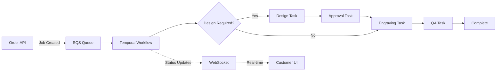
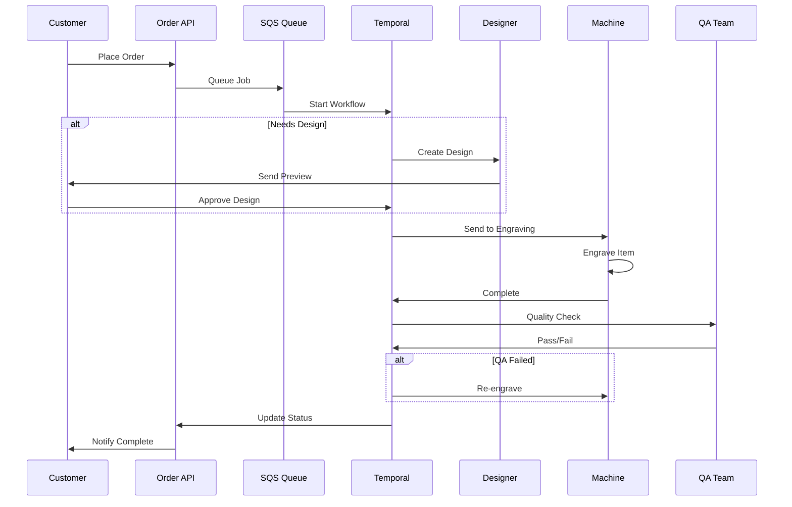

# Crown Trophy Engraving Job Flow
*Version: 1.0 | Generated: 2025-08-31*

## Overview
End-to-end workflow for engraving jobs using SQS/Temporal orchestration.

## Architecture



## SQS Configuration

```yaml
queues:
  engraving_jobs:
    name: crown-trophy-engraving-jobs
    type: FIFO
    delay_seconds: 0
    visibility_timeout: 300
    message_retention: 14_days
    dlq:
      name: crown-trophy-engraving-dlq
      max_receive_count: 3
    
  priority_jobs:
    name: crown-trophy-priority-jobs
    type: FIFO
    delay_seconds: 0
    visibility_timeout: 180
    
message_schema:
  type: object
  required: [job_id, customer_id, item_id, due_date]
  properties:
    job_id: string
    customer_id: string
    item_id: string
    text: array
    artwork_url: string
    rush: boolean
    due_date: string
```

## Temporal Workflow Definition

```typescript
// workflows/engravingWorkflow.ts
import { proxyActivities, sleep } from '@temporalio/workflow';

const activities = proxyActivities({
  startRetryOptions: {
    initialInterval: '1s',
    backoffCoefficient: 2,
    maximumAttempts: 3,
  },
});

export async function engravingWorkflow(job: EngravingJob) {
  // Step 1: Validate job
  await activities.validateJob(job);
  
  // Step 2: Design if needed
  if (job.requiresDesign) {
    const design = await activities.createDesign(job);
    
    // Step 3: Get approval
    const approved = await activities.getApproval(design);
    if (!approved) {
      await activities.requestRevision(design);
      return { status: 'revision_requested' };
    }
  }
  
  // Step 4: Send to engraving
  await activities.sendToMachine(job);
  
  // Step 5: Quality check
  const qaResult = await activities.qualityCheck(job);
  if (!qaResult.passed) {
    await activities.reengrave(job);
  }
  
  // Step 6: Mark complete
  await activities.markComplete(job);
  
  return { status: 'complete', job_id: job.id };
}
```

## Activity Implementations

```typescript
// activities/engravingActivities.ts

export async function validateJob(job: EngravingJob): Promise<void> {
  // Check inventory
  const item = await db.items.findOne({ id: job.item_id });
  if (!item || item.stock.available < 1) {
    throw new Error('Item not available');
  }
  
  // Validate text fits
  if (job.text.length > item.engraving_area.max_lines) {
    throw new Error('Text exceeds maximum lines');
  }
}

export async function createDesign(job: EngravingJob): Promise<Design> {
  // Generate preview using AI
  const preview = await generateAIPreview({
    item: job.item_id,
    text: job.text,
    font: job.font,
  });
  
  // Save design
  const design = await db.designs.create({
    job_id: job.id,
    preview_url: preview.url,
    status: 'pending_approval',
  });
  
  // Notify customer
  await sendNotification(job.customer_id, {
    type: 'design_ready',
    preview_url: preview.url,
  });
  
  return design;
}

export async function sendToMachine(job: EngravingJob): Promise<void> {
  // Queue for physical engraving
  await machineQueue.send({
    priority: job.rush ? 1 : 5,
    job_id: job.id,
    machine_id: selectBestMachine(job),
    estimated_time: calculateEngraveTime(job),
  });
  
  // Wait for completion
  await waitForMachineComplete(job.id);
}
```

## Order Orchestration Swimlanes



## Acceptance Tests for Scaffold

```yaml
tests:
  - name: "Happy path - text only"
    steps:
      - create_job:
          type: text_only
          rush: false
      - expect:
          status: complete
          duration: <30min
    
  - name: "Design approval flow"
    steps:
      - create_job:
          type: with_artwork
      - wait_for:
          status: pending_approval
      - approve_design
      - expect:
          status: complete
    
  - name: "Rush order prioritization"
    steps:
      - create_job:
          rush: true
      - expect:
          queue_position: 1
          completion: <2hours
    
  - name: "QA rejection handling"
    steps:
      - create_job
      - simulate_qa_failure
      - expect:
          retry_count: 1
          final_status: complete
    
  - name: "Inventory depletion"
    steps:
      - deplete_inventory
      - create_job
      - expect:
          status: blocked
          reason: no_inventory
    
  - name: "Concurrent job handling"
    steps:
      - create_jobs:
          count: 10
          parallel: true
      - expect:
          all_complete: true
          no_conflicts: true
```

## Monitoring & Metrics

```yaml
dashboards:
  operational:
    - jobs_in_queue: gauge
    - jobs_processing: gauge
    - jobs_completed_today: counter
    - average_completion_time: histogram
    - qa_pass_rate: percentage
    
  business:
    - revenue_today: sum
    - rush_order_percentage: percentage
    - customer_satisfaction: score
    - machine_utilization: percentage
    
alerts:
  - name: queue_backup
    condition: queue_depth > 50
    action: page_on_call
    
  - name: high_failure_rate
    condition: qa_pass_rate < 80%
    action: notify_supervisor
    
  - name: machine_offline
    condition: machine_heartbeat > 5min
    action: page_maintenance
```

## Error Handling

```typescript
// Error recovery strategies
const errorHandlers = {
  'MACHINE_ERROR': async (job) => {
    // Reassign to different machine
    await reassignToBackupMachine(job);
  },
  
  'DESIGN_TIMEOUT': async (job) => {
    // Auto-approve after 24 hours
    if (job.created_at < Date.now() - 24*60*60*1000) {
      await autoApproveDesign(job);
    }
  },
  
  'INVENTORY_DEPLETED': async (job) => {
    // Notify customer and offer alternatives
    await offerAlternatives(job);
  },
  
  'QA_FAILED': async (job, attempts) => {
    if (attempts < 3) {
      await reengrave(job);
    } else {
      await escalateToManager(job);
    }
  }
};
```

## Performance Targets

| Metric | Target | Current | Status |
|--------|--------|---------|--------|
| Job acceptance | <1 sec | - | 🔄 |
| Design generation | <30 sec | - | 🔄 |
| Approval wait time | <2 hrs | - | 🔄 |
| Engraving time | <15 min | - | 🔄 |
| End-to-end (standard) | <4 hrs | - | 🔄 |
| End-to-end (rush) | <1 hr | - | 🔄 |
| Queue processing | 100/hr | - | 🔄 |
| Error rate | <2% | - | 🔄 |

---

*Next Steps: Implement Temporal workflows and connect SQS queue*