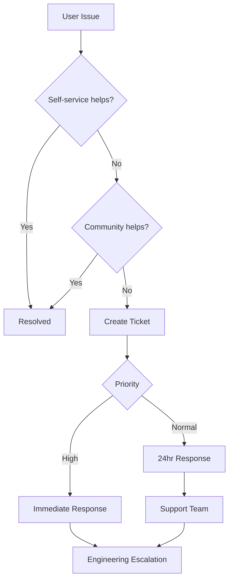

# Paintbox Scope Map v1
*Version: 1.0 | Generated: 2025-08-31*

## Product Vision
Comprehensive contractor management platform focusing on painter vertical with expansion capability.

## Core Modules

### 1. Project Management
```yaml
features:
  project_creation:
    priority: P0
    status: scaffold
    owner: @mike
    description: "Create and manage painting projects"
    
  task_tracking:
    priority: P0
    status: scaffold
    owner: @mike
    description: "Break projects into trackable tasks"
    
  scheduling:
    priority: P1
    status: seed
    description: "Calendar and crew scheduling"
    
  progress_photos:
    priority: P1
    status: seed
    description: "Photo documentation workflow"
```

### 2. Customer Management
```yaml
features:
  client_database:
    priority: P0
    status: ship
    owner: @sarah
    description: "Store client information"
    
  communication_hub:
    priority: P1
    status: scaffold
    description: "Centralized client communication"
    
  estimates_proposals:
    priority: P0
    status: scaffold
    owner: @sarah
    description: "Generate and track proposals"
    
  contract_management:
    priority: P1
    status: seed
    description: "Digital contract workflow"
```

### 3. Financial Tools
```yaml
features:
  invoicing:
    priority: P0
    status: scaffold
    owner: @tom
    description: "Create and send invoices"
    
  payment_processing:
    priority: P0
    status: seed
    description: "Accept online payments"
    
  expense_tracking:
    priority: P1
    status: spark
    description: "Track project expenses"
    
  profit_analytics:
    priority: P2
    status: spark
    description: "Project profitability analysis"
```

### 4. Crew Management
```yaml
features:
  worker_profiles:
    priority: P1
    status: seed
    description: "Manage crew information"
    
  time_tracking:
    priority: P1
    status: seed
    description: "Clock in/out system"
    
  payroll_integration:
    priority: P2
    status: spark
    description: "Connect to payroll services"
    
  certification_tracking:
    priority: P2
    status: spark
    description: "Track licenses and certs"
```

## User Stories (Top 3 to Ship)

### Story 1: Quick Quote to Contract
```gherkin
Feature: Convert estimate to contract in one flow

  As a painting contractor
  I want to create an estimate and convert it to a contract
  So that I can close deals faster

  Scenario: Create and send estimate
    Given I have a new client inquiry
    When I create an estimate with line items
    And I add photos and scope details
    Then I can send it via email/SMS
    And track when it's viewed

  Scenario: Client accepts estimate
    Given client views the estimate
    When they click "Accept"
    Then it converts to a contract
    And collects digital signature
    And schedules initial payment

  Acceptance Criteria:
    - Estimate creation <2 minutes
    - Mobile-responsive client view
    - Legal contract generation
    - Payment processing integration
    - Email/SMS notifications
```

### Story 2: Photo Progress Documentation
```gherkin
Feature: Document project progress with photos

  As a painting contractor
  I want to capture progress photos easily
  So that I can document work for clients and protect myself

  Scenario: Capture before/during/after
    Given I'm on a job site
    When I open the mobile app
    Then I can capture photos with labels
    And they auto-organize by project/room
    And sync when connection available

  Scenario: Share with client
    Given I have progress photos
    When I select photos to share
    Then client receives update
    And can comment/approve
    And history is maintained

  Acceptance Criteria:
    - Offline photo capture
    - Automatic GPS/timestamp
    - Room/area tagging
    - Batch upload when online
    - Client portal access
```

### Story 3: Intelligent Scheduling
```gherkin
Feature: Smart crew and project scheduling

  As a painting contractor
  I want to efficiently schedule crews
  So that I maximize productivity and minimize downtime

  Scenario: Schedule multi-day project
    Given I have a 5-day project
    When I assign crew members
    Then system checks availability
    And warns of conflicts
    And suggests optimal schedule

  Scenario: Handle weather delays
    Given rain is forecast
    When I check schedule
    Then system shows affected jobs
    And suggests rescheduling options
    And notifies affected parties

  Acceptance Criteria:
    - Drag-drop calendar interface
    - Crew availability tracking
    - Weather API integration
    - Automated notifications
    - Mobile schedule access
```

## Support Path

### Tier 1: Self-Service
```yaml
resources:
  help_center:
    url: help.paintbox.io
    content:
      - Getting started guide
      - Video tutorials
      - FAQ section
      - Best practices
      
  in_app_help:
    features:
      - Contextual tooltips
      - Guided onboarding
      - Feature tours
      - Search functionality
```

### Tier 2: Community Support
```yaml
channels:
  community_forum:
    url: community.paintbox.io
    moderation: contractor experts
    response_time: <4 hours
    
  facebook_group:
    members: 500+
    activity: daily
    
  office_hours:
    schedule: Tuesdays 2-3pm PST
    format: Zoom webinar
```

### Tier 3: Direct Support
```yaml
channels:
  email:
    address: support@paintbox.io
    sla: 24 hours
    hours: M-F 8am-6pm PST
    
  chat:
    availability: M-F 9am-5pm PST
    initial_response: <2 minutes
    resolution_target: <30 minutes
    
  phone:
    reserved_for: Enterprise customers
    callback_available: true
```

### Escalation Path


## Technical Architecture

### Frontend
```yaml
framework: React Native + Web
state: Redux Toolkit
styling: Tailwind CSS
testing: Jest + React Testing Library
```

### Backend
```yaml
api: GraphQL (Apollo Server)
database: PostgreSQL
auth: Auth0
storage: AWS S3
queue: SQS
```

### Infrastructure
```yaml
hosting: AWS ECS
cdn: CloudFront
monitoring: DataDog
ci_cd: GitHub Actions
```

## Success Metrics

### Adoption
- 100 contractors in first 90 days
- 50% weekly active usage
- 3+ projects per user per month

### Satisfaction
- NPS score >50
- Support ticket rate <5%
- Feature request engagement >30%

### Business
- $50k MRR within 6 months
- <$50 CAC
- >12 month retention

## Competitive Differentiation

| Feature | Paintbox | Competitor A | Competitor B |
|---------|----------|--------------|--------------|
| Painting-specific | ✅ | ❌ | ❌ |
| Photo documentation | ✅ Native | ⚠️ Basic | ❌ |
| Instant estimates | ✅ <2min | ⚠️ 10min | ⚠️ 15min |
| Crew scheduling | ✅ Smart | ✅ Basic | ⚠️ Manual |
| Price point | $49/mo | $99/mo | $79/mo |
| Mobile-first | ✅ | ⚠️ | ❌ |

## Go-to-Market Strategy

### Phase 1: Beta (Month 1-2)
- 10 hand-selected contractors
- Daily feedback sessions
- Rapid iteration
- Free access

### Phase 2: Early Access (Month 3-4)
- 50 contractors
- $29/mo promotional pricing
- Referral program
- Case study development

### Phase 3: Public Launch (Month 5+)
- Facebook ads in painter groups
- YouTube channel with tips
- Partnership with paint suppliers
- Trade show presence

---

*Next milestone: Complete Story 1 (Quick Quote to Contract) by end of Sprint 3*