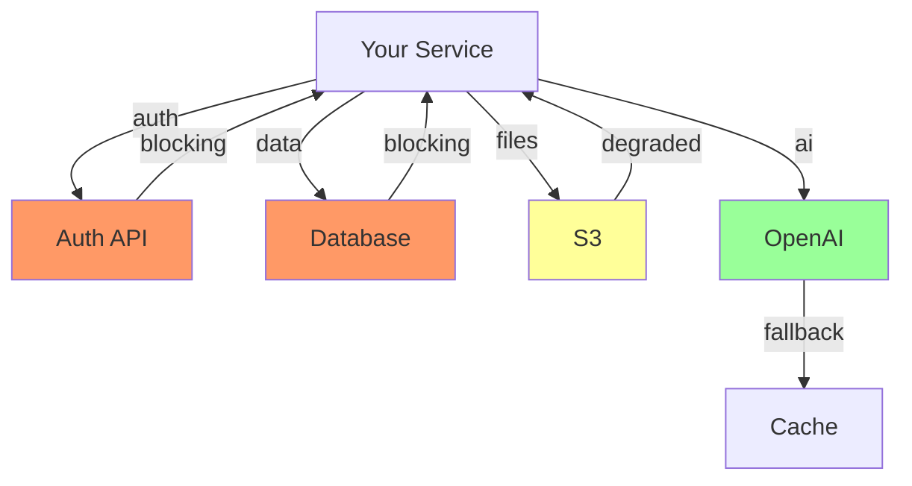

# Dependency Mapping Runbook
*Version: 1.0 | Generated: 2025-08-31*

## Purpose
Identify, document, and maintain visibility of all project dependencies to prevent blockers and enable smooth execution.

## When to Map Dependencies

### Required Mapping Points
1. **Seed Gate Entry** - Initial dependency discovery
2. **Scaffold Start** - Detailed technical dependencies
3. **Ship Planning** - Operational dependencies
4. **Monthly Review** - Drift detection

## Dependency Categories

### 1. Technical Dependencies
```yaml
internal_services:
  - service: Authentication API
    owner: @platform-team
    criticality: blocking
    fallback: none
    sla: 99.9%
    
  - service: Payment Gateway
    owner: @payments-team
    criticality: high
    fallback: queue for retry
    sla: 99.95%

external_apis:
  - service: AWS S3
    criticality: blocking
    fallback: local storage
    cost: $0.023/GB
    
  - service: OpenAI API
    criticality: medium
    fallback: cached responses
    cost: $0.02/request

libraries:
  - package: react@18
    license: MIT
    security: no known vulnerabilities
    update_frequency: monthly
    
  - package: prisma@5
    license: Apache 2.0
    security: check weekly
    update_frequency: on-release
```

### 2. Team Dependencies
```yaml
cross_pod:
  - team: Platform Pod
    dependency: API gateway setup
    timeline: Week 2
    owner: @mike
    status: confirmed
    
  - team: Design Pod
    dependency: UI mockups
    timeline: Week 1
    owner: @sarah
    status: in-progress

external_teams:
  - team: Legal
    dependency: Terms of Service review
    timeline: Week 4
    owner: @legal-contact
    status: pending

stakeholder_approvals:
  - approver: Patrick
    dependency: Ship gate review
    timeline: Week 6
    status: scheduled
```

### 3. Data Dependencies
```yaml
data_sources:
  - source: Customer Database
    access: read-only
    refresh: real-time
    owner: @data-team
    compliance: GDPR, CCPA
    
  - source: Analytics Pipeline
    access: batch daily
    refresh: 2am PST
    owner: @analytics-team
    compliance: SOC2

data_requirements:
  - volume: 10GB/day
  - retention: 90 days
  - backup: daily
  - recovery: <4 hours
```

### 4. Infrastructure Dependencies
```yaml
compute:
  - resource: EC2 t3.large
    count: 3
    region: us-east-1
    cost: $180/month
    
  - resource: RDS PostgreSQL
    size: db.t3.medium
    storage: 100GB
    cost: $89/month

networking:
  - requirement: Public internet
    bandwidth: 100Mbps
    latency: <100ms
    
  - requirement: VPN access
    users: 5
    cost: $50/month

deployment:
  - platform: Kubernetes
    version: 1.28+
    access: required
    
  - platform: GitHub Actions
    minutes: 2000/month
    cost: included
```

## Mapping Process

### Step 1: Discovery Session
```markdown
## Dependency Discovery Template

**Project:** [Name]
**Date:** [Date]
**Participants:** [List]

### Questions to Ask:
1. What external services will this call?
2. What internal APIs does this need?
3. What data sources are required?
4. Who needs to approve decisions?
5. What could block deployment?
6. What happens if X is unavailable?

### Output:
- Initial dependency list
- Risk assessment
- Mitigation strategies
```

### Step 2: Create Visual Map


### Step 3: Document in Repository
Create `/docs/dependencies.md`:
```markdown
# [Project] Dependencies

## Critical Path (Blocking)
These must be available for service to function:
- Authentication Service (99.9% SLA)
- Primary Database (99.95% SLA)
- Message Queue (99.9% SLA)

## Degraded Mode (Non-blocking)
Service continues with reduced functionality:
- AI Enhancement API → Use cached responses
- Analytics Pipeline → Queue for later
- Email Service → Retry with backoff

## Enhancement (Optional)
Nice to have but not required:
- Advanced monitoring
- A/B testing platform
- Performance profiler
```

### Step 4: Monitor and Update

#### Weekly Review Checklist
- [ ] Check all API endpoints still responding
- [ ] Verify SLAs being met
- [ ] Review any new dependencies added
- [ ] Update cost tracking
- [ ] Check for deprecation notices

#### Automated Monitoring
```yaml
# .github/workflows/dependency-check.yml
name: Dependency Health Check
on:
  schedule:
    - cron: '0 9 * * 1'  # Weekly Monday 9am
    
jobs:
  check:
    runs-on: ubuntu-latest
    steps:
      - name: Check External APIs
        run: |
          curl -f https://api.service.com/health || exit 1
          
      - name: Check Internal Services
        run: |
          ./scripts/check-dependencies.sh
          
      - name: Security Scan
        run: |
          npm audit
          pip-audit
          
      - name: License Check
        run: |
          license-checker --summary
```

## Dependency Risk Matrix

| Dependency | Criticality | Likelihood of Failure | Impact | Mitigation |
|------------|-------------|----------------------|---------|------------|
| Auth API | Blocking | Low | High | Circuit breaker, cache sessions |
| Database | Blocking | Low | High | Read replicas, connection pool |
| External API | High | Medium | Medium | Fallback service, queue |
| NPM Package | Medium | Low | Low | Lock versions, security scan |
| Team Approval | Medium | Medium | Medium | Early engagement, backup approver |

## Fallback Strategies

### Circuit Breaker Pattern
```javascript
class CircuitBreaker {
  constructor(service, threshold = 5, timeout = 60000) {
    this.service = service;
    this.failureCount = 0;
    this.threshold = threshold;
    this.timeout = timeout;
    this.state = 'CLOSED';
  }
  
  async call(...args) {
    if (this.state === 'OPEN') {
      return this.fallback(...args);
    }
    
    try {
      const result = await this.service(...args);
      this.onSuccess();
      return result;
    } catch (error) {
      this.onFailure();
      throw error;
    }
  }
}
```

### Graceful Degradation
```typescript
async function enhancedSearch(query: string) {
  try {
    // Try AI-powered search
    return await aiSearch(query);
  } catch (error) {
    console.warn('AI search failed, falling back');
    try {
      // Fallback to elasticsearch
      return await elasticSearch(query);
    } catch (error) {
      console.warn('Elastic failed, using basic search');
      // Final fallback to database
      return await basicDBSearch(query);
    }
  }
}
```

## Communication Templates

### Dependency Request
```markdown
Subject: Dependency Request: [Your Project] needs [Their Service]

Hi [Owner],

**Project:** [Name]
**Timeline:** Need by [Date]
**Dependency:** [Specific requirement]

**What we need:**
- [Specific API endpoint or resource]
- [Expected SLA]
- [Data format/volume]

**Impact if delayed:**
[Business impact]

Can we schedule 15 minutes to discuss?

Thanks,
[Your name]
```

### Blocker Notification
```markdown
Subject: BLOCKED: [Project] waiting on [Dependency]

**Blocked since:** [Date/time]
**Impact:** [Cannot proceed with X]
**Attempted solutions:**
1. [What you tried]
2. [What else you tried]

**Need:**
[Specific action required]

**Deadline:** [When this becomes critical]

Please advise on timeline or alternatives.
```

## Tools and Automation

### Dependency Scanner
```bash
#!/bin/bash
# scan-dependencies.sh

echo "Scanning project dependencies..."

# Check package.json
if [ -f package.json ]; then
  echo "NPM Dependencies:"
  npm list --depth=0
  npm audit
fi

# Check requirements.txt
if [ -f requirements.txt ]; then
  echo "Python Dependencies:"
  pip list
  safety check
fi

# Check Dockerfile
if [ -f Dockerfile ]; then
  echo "Docker Base Images:"
  grep FROM Dockerfile
fi

# Check API calls
echo "External API Calls:"
grep -r "fetch\|axios\|http" src/ | grep -E "https?://"

# Check environment variables
echo "Required Environment Variables:"
grep -r "process.env\|os.environ" src/
```

### Update Tracking
```sql
-- Track dependency changes over time
CREATE TABLE dependency_history (
  id SERIAL PRIMARY KEY,
  project VARCHAR(100),
  dependency VARCHAR(200),
  version VARCHAR(50),
  added_date DATE,
  removed_date DATE,
  criticality VARCHAR(20),
  owner VARCHAR(100)
);

-- Query for current dependencies
SELECT * FROM dependency_history 
WHERE removed_date IS NULL
ORDER BY criticality DESC, added_date ASC;
```

## Metrics to Track

### Health Metrics
- Dependency availability (uptime %)
- Response time (p50, p95, p99)
- Error rate
- Cost per dependency

### Risk Metrics
- Single points of failure count
- Dependencies without fallbacks
- External dependencies count
- Average dependency age

### Process Metrics
- Time to identify dependencies
- Blocker resolution time
- False dependency rate
- Dependency drift over time

---

*"Map everything, assume nothing, prepare for failure."*

**Key Principle:** Every dependency is a potential point of failure. Document it, monitor it, and have a plan when it fails.